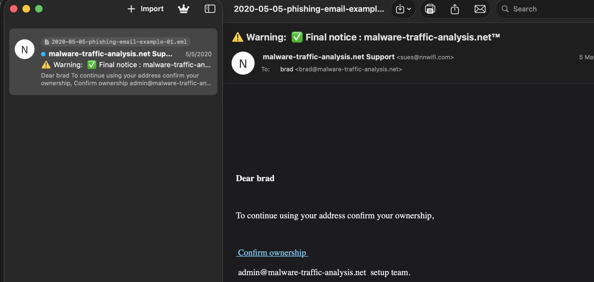
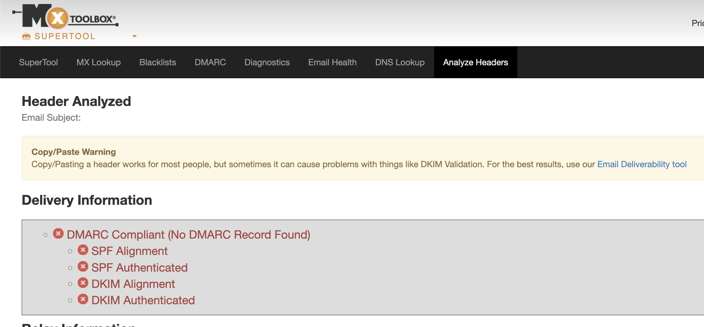
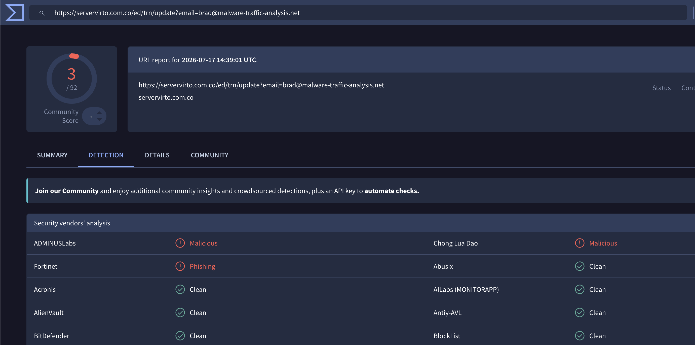
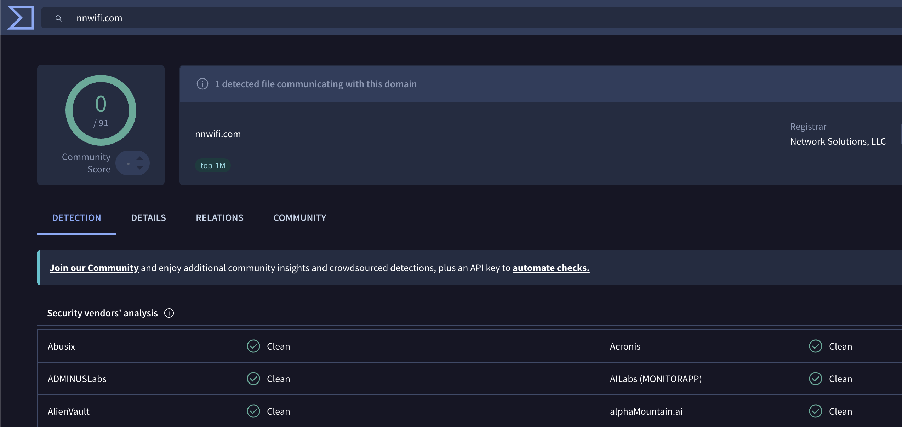
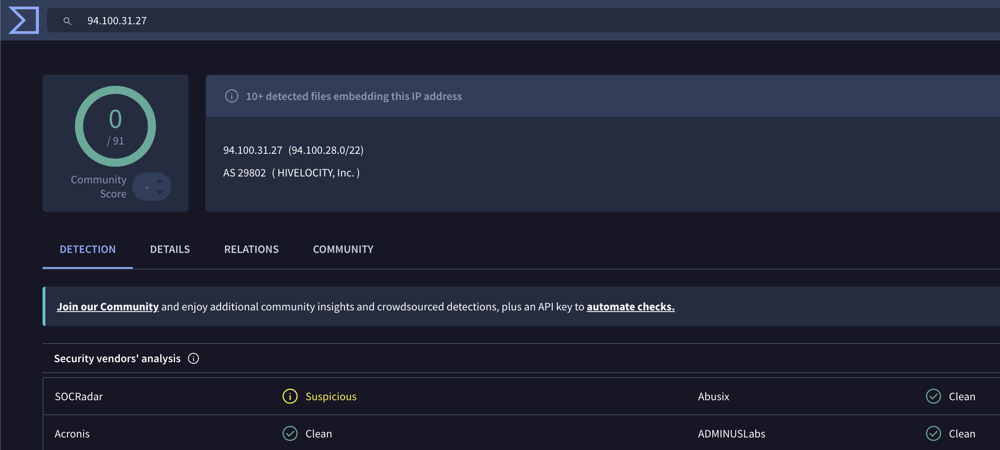
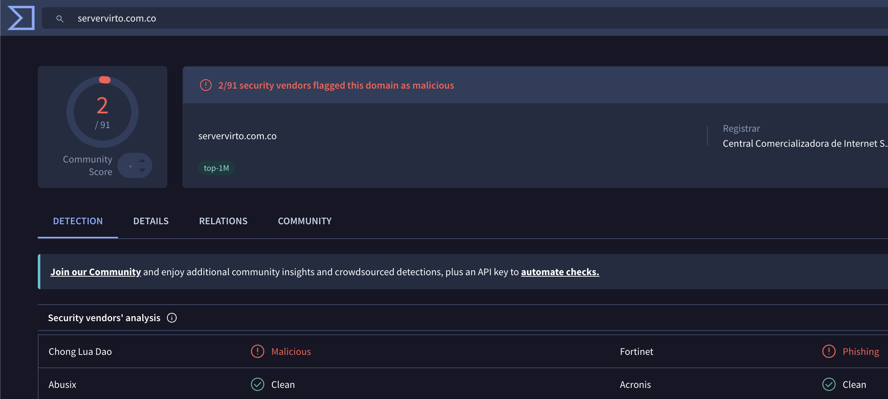
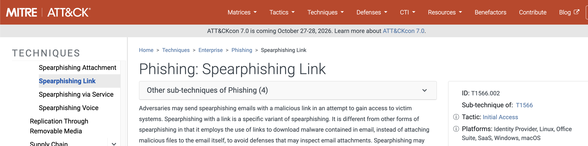

# Project 01 – Phishing Investigation

## Overview

This project demonstrates a real-world phishing email investigation from the perspective of a Tier 1 Security Operations Center (SOC) Analyst.

A publicly available phishing email sample was analyzed to identify indicators of compromise (IOCs), validate malicious infrastructure using threat intelligence, map the attack to the MITRE ATT&CK framework, and provide containment recommendations.

---

## Scenario

A user reported a suspicious email claiming to originate from **malware-traffic-analysis.net Support** requesting confirmation of account ownership.

The objective was to determine whether the email was malicious and document the investigation.

---

## Objectives

- Analyze a phishing email
- Perform email header analysis
- Extract Indicators of Compromise (IOCs)
- Validate IOCs using threat intelligence
- Map attacker behavior to MITRE ATT&CK
- Recommend containment actions
- Produce an executive incident summary

---

## Technologies Used

- MXToolbox Header Analyzer
- VirusTotal
- URLScan.io
- MITRE ATT&CK Framework

---

## Skills Demonstrated

- Email Header Analysis
- IOC Extraction
- Threat Intelligence
- Phishing Investigation
- MITRE ATT&CK Mapping
- Incident Documentation
- Security Analysis

---

## Project Structure

```text
01-Phishing-Investigation/
│
├── README.md
├── Queries/
│   └── IOC_Searches.md
├── Screenshots/
│   ├── 01_Raw_Phishing_Email.png
│   ├── 02_Header_Analysis_MXToolbox.png
│   ├── 03_VirusTotal_URL.png
│   ├── 04_VirusTotal_Sender_Domain.png
│   ├── 05_VirusTotal_IP.png
│   ├── 06_URLScan_Domain.png
│   └── 07_MITRE_ATTACK_T1566_002.png
│
└── Files/
    └── phishing-email-01.eml
```

---

# Investigation

## Step 1 – Email Analysis

The phishing email sample was opened and reviewed. The message attempted to persuade the recipient to confirm ownership of their email account using a fraudulent hyperlink.



---

## Step 2 – Header Analysis

Email headers were analyzed using MXToolbox.

Key observations:

- SPF authentication failed.
- DKIM authentication failed.
- No DMARC record was present.
- The sender domain did not align with the organization being impersonated.

These findings increased confidence that the email was fraudulent.



---

## Step 3 – Indicator of Compromise (IOC) Extraction

| IOC Type | Value |
|----------|-------|
| Sender Email | sues@nnwifi.com |
| Sender Domain | nnwifi.com |
| Sender IP | 94.100.31.27 |
| Phishing Domain | servervirto.com.co |
| Phishing URL | https://servervirto.com.co/ed/trn/update?... |

---

## Step 4 – Threat Intelligence

The extracted IOCs were investigated using VirusTotal and URLScan.

Threat intelligence helped validate the reputation of the phishing infrastructure and identify previously reported malicious activity.

### VirusTotal







### URLScan



---

## Step 5 – MITRE ATT&CK Mapping

The phishing activity aligned with:

- **T1566 – Phishing**
- **T1566.002 – Spearphishing Link**



---

## Containment Recommendations

- Block the sender domain.
- Block the phishing URL.
- Block the malicious domain.
- Search for similar emails across the organization.
- Notify potentially affected users.
- Reset credentials if the link was accessed.
- Review sign-in activity for suspicious authentication attempts.
- Enforce multi-factor authentication (MFA).

---

## Lessons Learned

- Email sender names should not be trusted without validating the sender's domain.
- Email authentication failures (SPF, DKIM, and DMARC) are valuable indicators during phishing investigations.
- Threat intelligence platforms help determine whether infrastructure has been associated with malicious activity.
- IOC validation and structured documentation support effective incident response.

---

## Outcome

This project demonstrated a complete phishing email investigation using industry-standard techniques, including email header analysis, IOC extraction, threat intelligence enrichment, and MITRE ATT&CK mapping.

The investigation concluded that the email represented a phishing attempt designed to persuade the recipient to access a fraudulent website and potentially disclose credentials.

---

**Status:** Completed