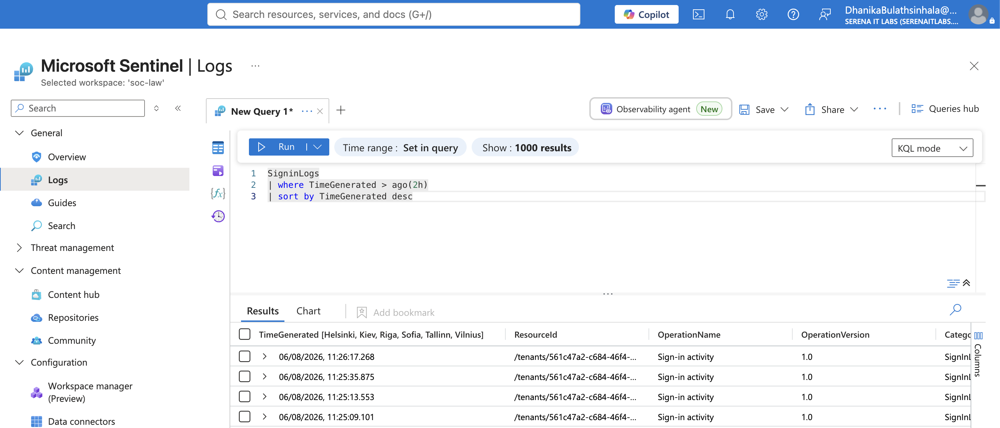
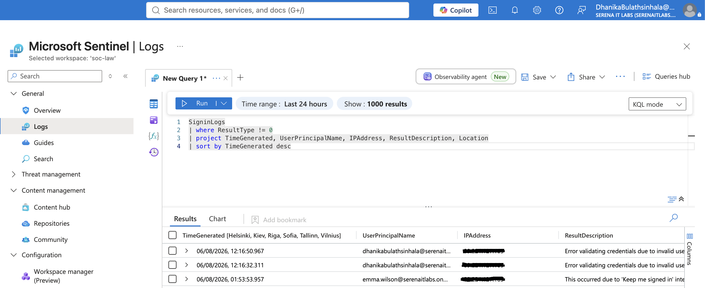
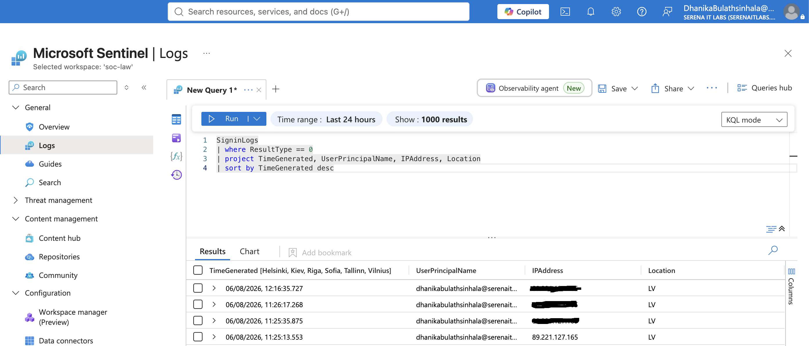
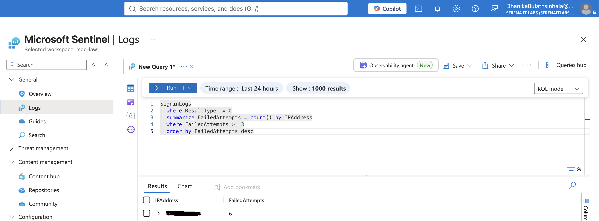
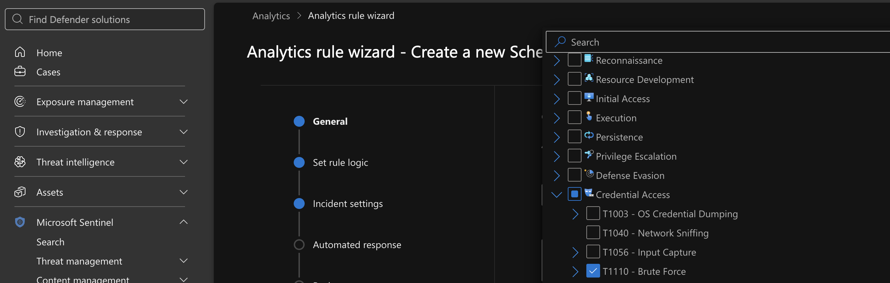
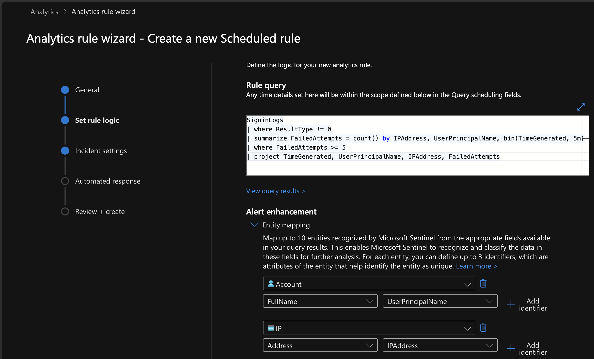
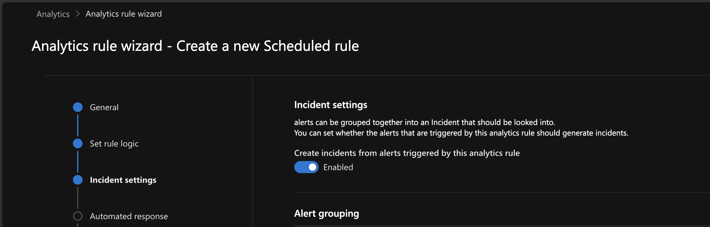
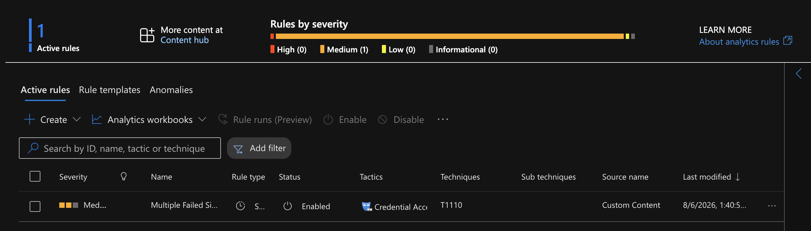

# Project 02 – SIEM Detection and Alert Triage

## Overview

This project demonstrates identity-focused detection engineering and alert triage using Microsoft Sentinel and Microsoft Entra ID sign-in logs.

The lab generated repeated failed authentication attempts, queried the resulting telemetry with Kusto Query Language (KQL), and created a scheduled Microsoft Sentinel analytics rule to detect multiple failed sign-ins from the same IP address.

---

## Scenario

A user account generated several failed sign-in attempts from the same source IP address within a short period.

The SOC analyst was required to:

- Verify that authentication logs were being ingested
- Identify failed and successful sign-ins
- Detect repeated failures from the same IP address
- Create a custom analytics rule
- Map the activity to MITRE ATT&CK
- Document the detection outcome

---

## Objectives

- Query Microsoft Entra ID sign-in telemetry
- Identify failed authentication attempts
- Identify successful authentication events
- Detect repeated failed sign-ins from a single IP address
- Create a custom Microsoft Sentinel analytics rule
- Configure entity mappings
- Map the behavior to MITRE ATT&CK
- Validate detection logic using real lab-generated events

---

## Technologies Used

- Microsoft Sentinel
- Microsoft Defender portal
- Microsoft Entra ID
- Azure Log Analytics
- Kusto Query Language (KQL)
- MITRE ATT&CK

---

## Project Structure

```text
02-SIEM-Detection-and-Alert-Triage/
├── README.md
├── Queries/
│   ├── 01-Recent-Signins.kql
│   ├── 02-Failed-Signins.kql
│   ├── 03-Successful-Signins.kql
│   └── 04-Repeated-Failed-Signins.kql
├── Screenshots/
│   ├── 01_SigninLogs_Recent.png
│   ├── 02_Failed_Logins.png
│   ├── 03_Successful_Logins.png
│   ├── 04_Repeated_Failed_Logins.png
│   ├── 05_Create_Analytics_Rule.png
│   ├── 06_Rule_Logic.png
│   ├── 07_Incident_Settings.png
│   └── 08_Analytics_Rule_Enabled.png
└── Files/
```

---

# Lab Environment

The lab used a Microsoft Sentinel workspace connected to:

- Microsoft Entra ID
- Microsoft 365
- Microsoft Defender XDR

Authentication events were generated by performing multiple failed sign-in attempts followed by a successful sign-in.

---

# Authentication Log Analysis

## Recent Sign-ins

The first query verified that Entra ID sign-in records were being ingested into the Sentinel workspace.

```kusto
SigninLogs
| where TimeGenerated > ago(30m)
| sort by TimeGenerated desc
```



---

## Failed Sign-ins

Failed authentication attempts were isolated using the `ResultType` field.

```kusto
SigninLogs
| where ResultType != 0
| project TimeGenerated, UserPrincipalName, IPAddress, ResultDescription, Location
| sort by TimeGenerated desc
```



---

## Successful Sign-ins

Successful authentication events were identified separately.

```kusto
SigninLogs
| where ResultType == 0
| project TimeGenerated, UserPrincipalName, IPAddress, Location
| sort by TimeGenerated desc
```



---

## Repeated Failed Sign-ins

The following query grouped failed authentication attempts by source IP address, user account, and five-minute time window.

```kusto
SigninLogs
| where TimeGenerated > ago(30m)
| where ResultType != 0
| summarize FailedAttempts = count()
    by IPAddress, UserPrincipalName, bin(TimeGenerated, 5m)
| order by FailedAttempts desc
```

The query identified seven failed sign-in attempts from the same IP address during one five-minute interval.



---

# Analytics Rule Creation

A scheduled Microsoft Sentinel analytics rule was created with the following configuration:

| Setting | Value |
|---|---|
| Rule name | Multiple Failed Sign-ins from Same IP |
| Severity | Medium |
| Rule type | Scheduled query rule |
| Query frequency | Every 5 minutes |
| Lookup period | Last 5 minutes |
| Threshold | More than 0 results |
| Tactic | Credential Access |
| Technique | T1110 – Brute Force |



---

## Detection Logic

```kusto
SigninLogs
| where ResultType != 0
| summarize FailedAttempts = count()
    by IPAddress, UserPrincipalName, bin(TimeGenerated, 5m)
| where FailedAttempts >= 5
| project TimeGenerated, UserPrincipalName, IPAddress, FailedAttempts
```



---

## Entity Mapping

The analytics rule mapped the following entities:

| Entity | Field |
|---|---|
| Account | `UserPrincipalName` |
| IP address | `IPAddress` |

Entity mapping gives analysts additional context during alert and incident investigation.

---

## Incident Settings

Incident creation from generated alerts was enabled.

Alert grouping was left disabled so that each matching detection could be reviewed independently.



---

# Detection Validation

The rule was enabled successfully, and the KQL detection logic was validated manually against live Entra ID telemetry.

The query returned:

```text
Failed attempts: 7
Source IP: Single IP address
Time window: 5 minutes
User account: Single Entra ID account
```

This confirmed that the detection logic correctly identified activity meeting the configured threshold.



---

## Platform Observation

An incident was not automatically generated during the available lab window.

The rule itself was enabled, and the underlying query successfully detected the simulated authentication activity. This confirmed the detection logic and rule configuration while avoiding an unsupported claim that an incident was created.

---

# MITRE ATT&CK Mapping

| Tactic | Technique | ID |
|---|---|---|
| Credential Access | Brute Force | T1110 |

The repeated failed authentication attempts were consistent with brute-force-style behavior.

The activity was generated in a controlled lab and did not represent an actual compromise.

---

# Analyst Findings

- Multiple failed sign-in attempts originated from one IP address.
- Seven failures occurred within a five-minute interval.
- A successful sign-in event was available for comparison.
- The custom KQL query correctly identified the activity.
- The analytics rule was created and enabled.
- Account and IP entities were mapped for investigation context.
- No evidence of a real account compromise was established.

---

# Recommended Response Actions

For a production environment, the following actions would be appropriate:

- Review the affected account's recent sign-in history
- Verify the source IP address and geographic location
- Confirm whether the activity was expected
- Review MFA results and Conditional Access decisions
- Reset the user's password if compromise is suspected
- Revoke active sessions where necessary
- Require MFA re-registration if appropriate
- Block the source IP where justified
- Monitor for similar activity across other accounts
- Escalate if the pattern suggests password spraying or credential compromise

---

# Skills Demonstrated

- Microsoft Sentinel administration
- Entra ID sign-in log analysis
- KQL query development
- Authentication event triage
- Detection engineering
- Scheduled analytics rules
- Entity mapping
- Threshold-based detection
- MITRE ATT&CK mapping
- SOC documentation
- Identity threat analysis

---

# Lessons Learned

- Detection queries should be validated manually before being deployed as analytics rules.
- Time windows and thresholds directly affect detection reliability.
- Successful and failed authentication events should be reviewed together for context.
- Entity mapping improves investigation quality by linking alerts to accounts and IP addresses.
- A working query does not always guarantee immediate incident creation because scheduling and platform processing can introduce delays.
- Investigation reports should distinguish between confirmed results and expected platform behavior.

---

## Outcome

This project demonstrated an end-to-end identity detection workflow using Microsoft Sentinel.

Real authentication activity was generated, analyzed with KQL, and used to create a scheduled analytics rule mapped to MITRE ATT&CK T1110. The detection logic successfully identified repeated failed sign-ins from the same source IP within a five-minute period.

---

**Status:** Completed