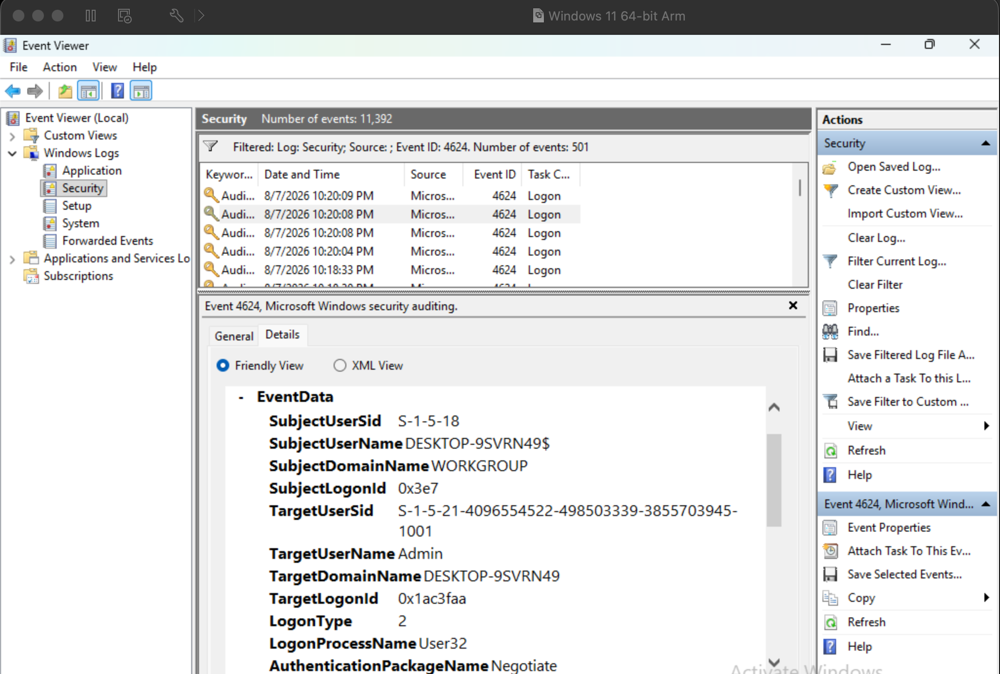
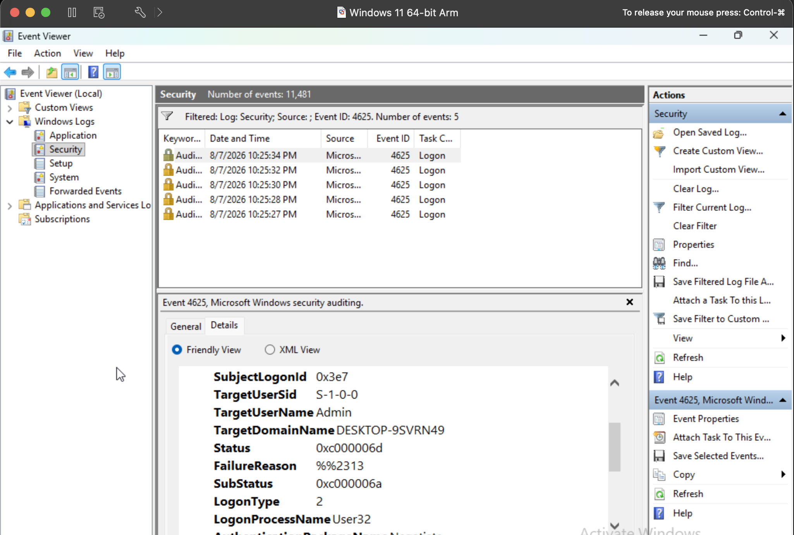
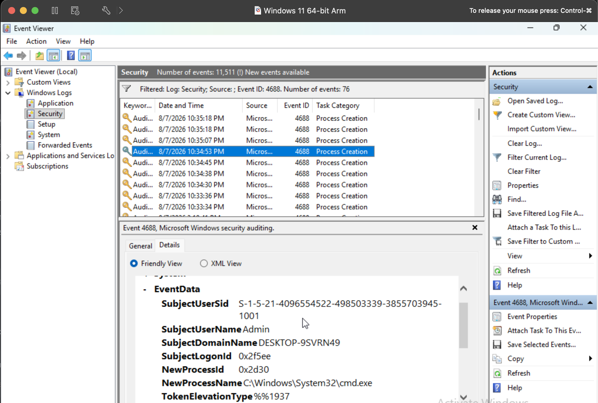
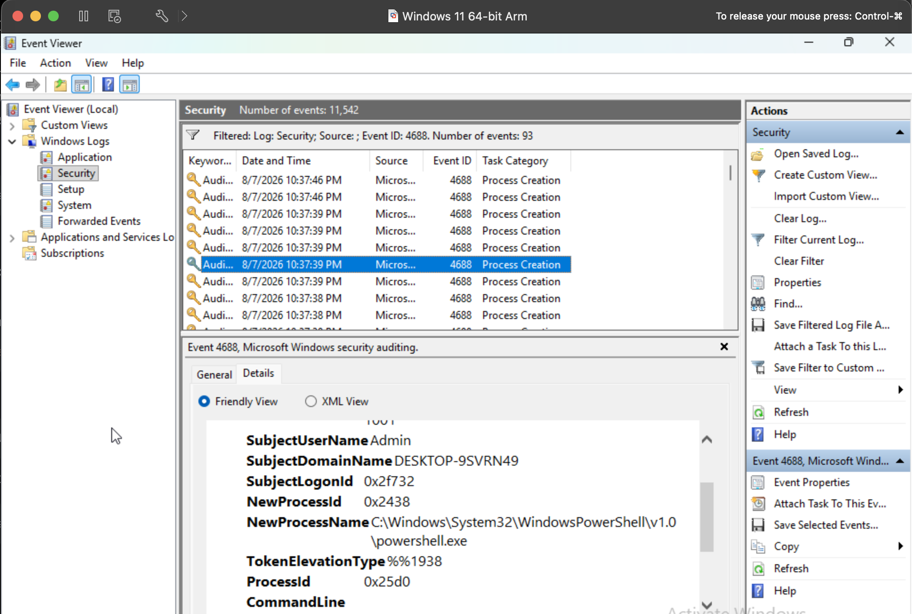
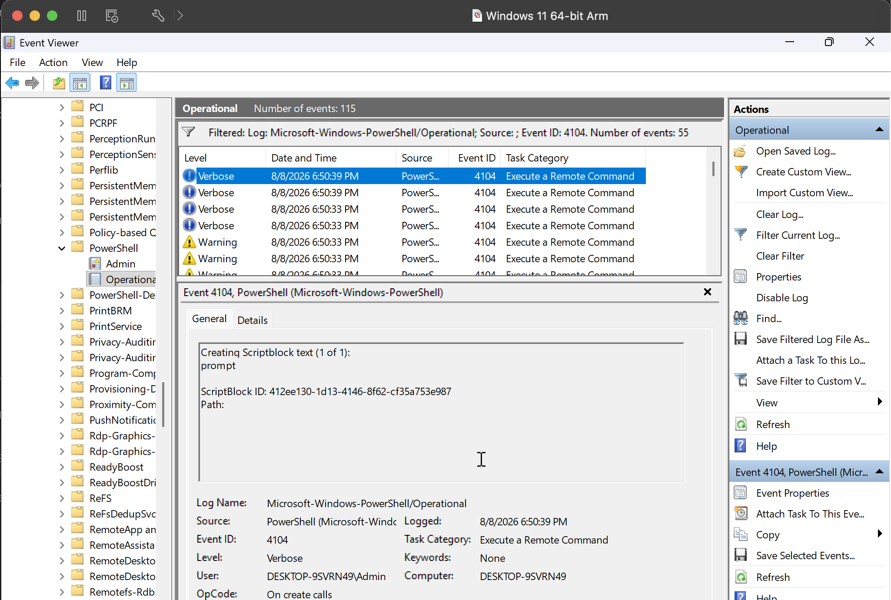
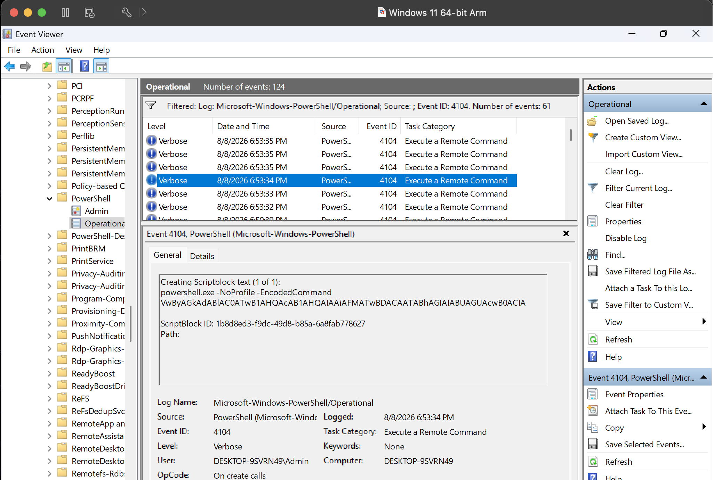
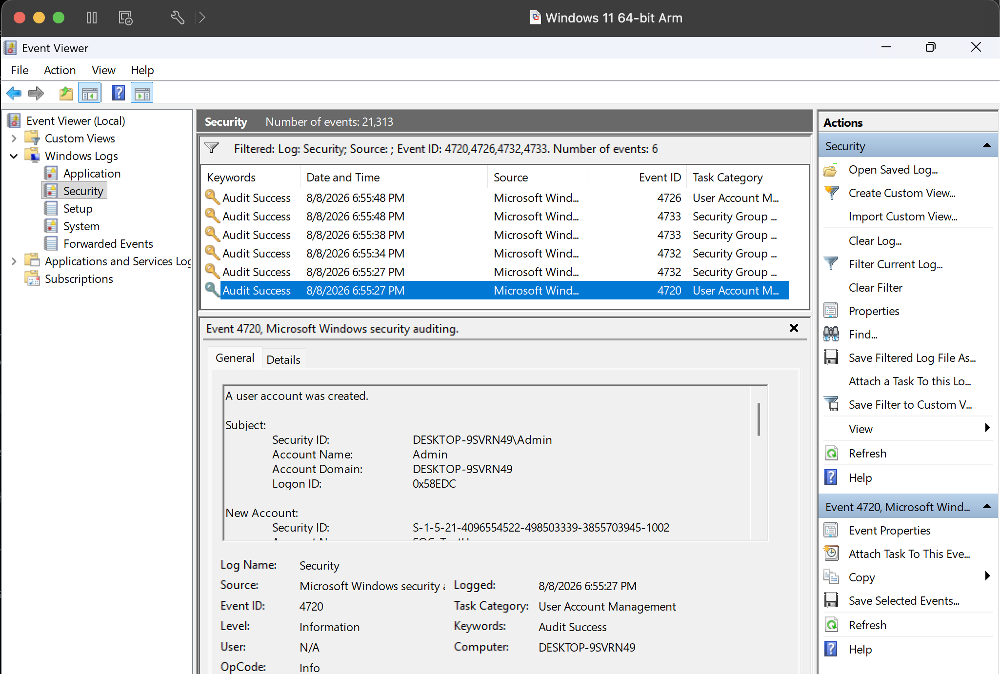
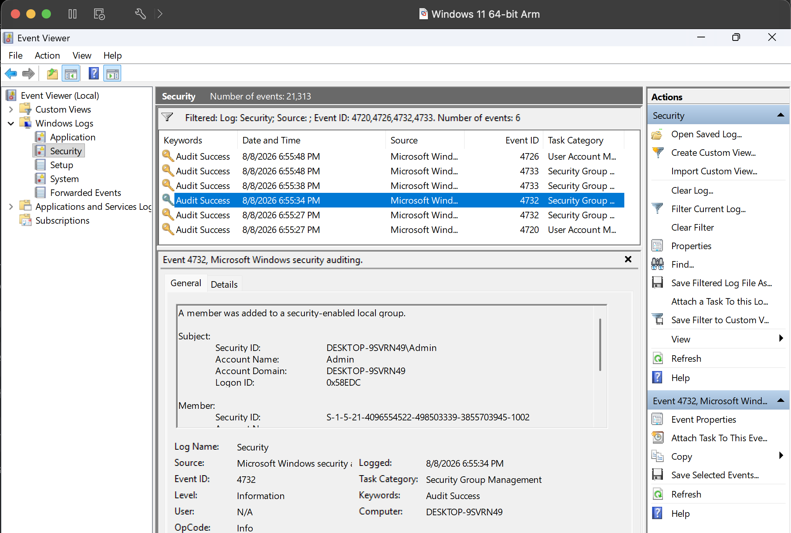

# Project 03 – Windows Event Log Hunting & Security Investigation

## Overview

This project demonstrates Windows endpoint investigation using native Windows Security and PowerShell event logs.

The lab generated controlled authentication, process execution, PowerShell, and account-management activity and then investigated the resulting Windows event records from the perspective of a SOC analyst.

The project focuses on identifying security-relevant Windows Event IDs, understanding their context, and documenting findings that could indicate suspicious endpoint activity.

---

## Scenario

A SOC analyst is reviewing activity from a Windows 11 endpoint.

The investigation focuses on:

- Successful and failed authentication
- Process creation
- PowerShell execution
- Encoded PowerShell activity
- Local user creation
- Administrative group membership changes

All activity was generated intentionally in a controlled lab environment.

---

## Objectives

- Investigate Windows authentication events
- Distinguish successful and failed logons
- Interpret Windows Logon Types
- Enable Process Creation auditing
- Investigate process execution using Event ID 4688
- Enable PowerShell Script Block Logging
- Investigate PowerShell Event ID 4104
- Identify encoded PowerShell execution
- Investigate local account creation
- Detect addition of users to the local Administrators group
- Map relevant activity to MITRE ATT&CK

---

## Technologies Used

- Windows 11
- Windows Event Viewer
- Windows Security Logs
- PowerShell
- Windows Audit Policy
- PowerShell Script Block Logging
- MITRE ATT&CK

---

## Project Structure

```text
03-Windows-Event-Log-Hunting/
├── README.md
├── Screenshots/
│   ├── 01-Successful-Interactive-Logon-4624.png
│   ├── 02-Failed-Interactive-Logon-4625.png
│   ├── 03-Process-Creation-CMD-4688.png
│   ├── 04-Process-Creation-PowerShell-4688.png
│   ├── 05-PowerShell-ScriptBlock-4104.png
│   ├── 06-Encoded-PowerShell-Detection-4104.png
│   ├── 07-User-Added-to-Administrators-4732.png
│   └── 08-Local-User-Created-4720.png
└── Queries/
    └── Lab-Commands.md
```

---

# Lab 1 – Authentication Investigation

## Event ID 4624 – Successful Logon

A successful interactive Windows logon was identified using Event ID `4624`.

The selected event showed:

```text
Logon Type: 2
```

Logon Type 2 represents an interactive user logon directly at the endpoint.



---

## Event ID 4625 – Failed Logon

Failed authentication attempts were generated using incorrect credentials and reviewed through Event ID `4625`.

The observed event showed:

```text
Logon Type: 2
```

This indicated a failed interactive authentication attempt.

The event included failure information that could be used by an analyst to determine whether the activity represented user error, brute-force behavior, or another authentication issue.



---

# Lab 2 – Process Creation Investigation

Windows Process Creation auditing was enabled using:

```powershell
auditpol /set /subcategory:"Process Creation" /success:enable
```

Process execution was then investigated using Event ID `4688`.

---

## Command Prompt Execution

A `cmd.exe` process creation event was identified.

Relevant fields available in Event ID 4688 include:

- New Process Name
- Creator Process Name
- Account Name
- Process ID
- Command Line, when available



---

## PowerShell Execution

A separate Event ID `4688` record confirmed PowerShell process execution.

This type of event is useful when investigating suspicious script execution or command-line activity.



---

# Lab 3 – PowerShell Script Block Logging

PowerShell Script Block Logging was enabled through the Windows registry.

This generated PowerShell Operational events containing executed script content.

Event ID:

```text
4104
```

A 4104 event was reviewed to examine PowerShell command activity.



---

# Lab 4 – Encoded PowerShell Detection

A harmless encoded PowerShell command was executed to generate telemetry resembling a technique that may require SOC investigation.

The command used:

```text
-EncodedCommand
```

Encoded PowerShell can be legitimate, but it is often investigated because encoding can obscure the intent of a command.

The corresponding Event ID `4104` provided visibility into the PowerShell activity.



---

## MITRE ATT&CK Mapping

| Tactic | Technique | ID |
|---|---|---|
| Execution | PowerShell | T1059.001 |

The presence of encoded PowerShell alone does not confirm malicious activity. Additional context and endpoint evidence are required before assigning a malicious verdict.

---

# Lab 5 – Account and Privilege Change Investigation

A temporary local user was created and added to the local Administrators group.

This generated security events associated with account and group changes.

---

## Event ID 4720 – User Account Created

Event ID `4720` recorded the creation of the temporary local account.

Account creation can be significant during incident response because attackers may create additional accounts to establish persistence.



---

## Event ID 4732 – Member Added to Local Security Group

Event ID `4732` recorded the addition of the temporary user to the local Administrators group.

This is particularly important during security monitoring because unexpected administrative group membership changes may indicate privilege escalation or persistence activity.



---

## MITRE ATT&CK Relevance

Potentially relevant techniques include:

| Activity | Technique |
|---|---|
| Command execution through PowerShell | T1059.001 – PowerShell |
| Account creation | T1136 – Create Account |
| Administrative group modification | Requires investigation in context of privilege or persistence activity |

The lab activity was intentionally generated and does not represent a real compromise.

---

# Key Windows Event IDs Investigated

| Event ID | Description |
|---|---|
| 4624 | Successful logon |
| 4625 | Failed logon |
| 4688 | New process created |
| 4104 | PowerShell script block logging |
| 4720 | User account created |
| 4732 | Member added to local security group |

---

# Analyst Findings

- Successful interactive logon activity was identified using Event ID 4624.
- Failed interactive authentication was identified using Event ID 4625.
- Process execution was visible through Event ID 4688.
- PowerShell command content was captured through Script Block Logging.
- Encoded PowerShell execution produced identifiable security telemetry.
- Local user creation generated Event ID 4720.
- Administrative group membership changes generated Event ID 4732.
- Native Windows logging provided significant endpoint visibility without requiring an additional EDR agent.

---

# Recommended SOC Response

If similar activity appeared unexpectedly in a production environment, an analyst should:

- Identify the affected user and endpoint
- Review authentication history
- Determine whether failed logons are isolated or repeated
- Review parent and child processes
- Examine PowerShell command contents
- Investigate encoded or obfuscated commands
- Verify whether newly created accounts are authorized
- Review administrative group membership changes
- Correlate activity with network and identity telemetry
- Escalate if evidence suggests privilege escalation or persistence

---

# Skills Demonstrated

- Windows Event Log Analysis
- Windows Security Event IDs
- Authentication Investigation
- Process Execution Analysis
- PowerShell Security Monitoring
- Endpoint Threat Hunting
- Windows Audit Policy
- Account Change Monitoring
- Privilege Change Investigation
- MITRE ATT&CK Mapping
- SOC Triage
- Endpoint Security Analysis

---

# Lessons Learned

- Windows native logs provide substantial security visibility when appropriate auditing is enabled.
- Logon Type provides important context when analyzing authentication events.
- Event ID 4688 helps identify process execution and parent-child relationships.
- PowerShell Script Block Logging provides deeper visibility than process creation events alone.
- Encoded PowerShell should be investigated but should not automatically be classified as malicious.
- Account creation and administrative group membership changes are high-value events during endpoint investigations.
- Individual events should be correlated with additional evidence before determining whether activity is malicious.

---

## Outcome

This project demonstrated a Windows endpoint investigation using native Windows Security and PowerShell logs.

Controlled activity was generated and successfully identified through authentication, process creation, PowerShell, account creation, and administrative privilege-change events, providing practical experience with endpoint telemetry commonly analyzed by SOC teams.

---

**Status:** Completed