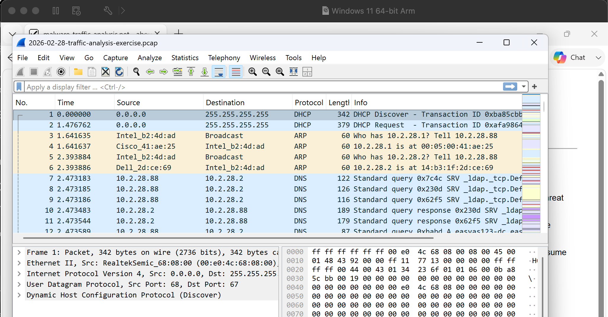
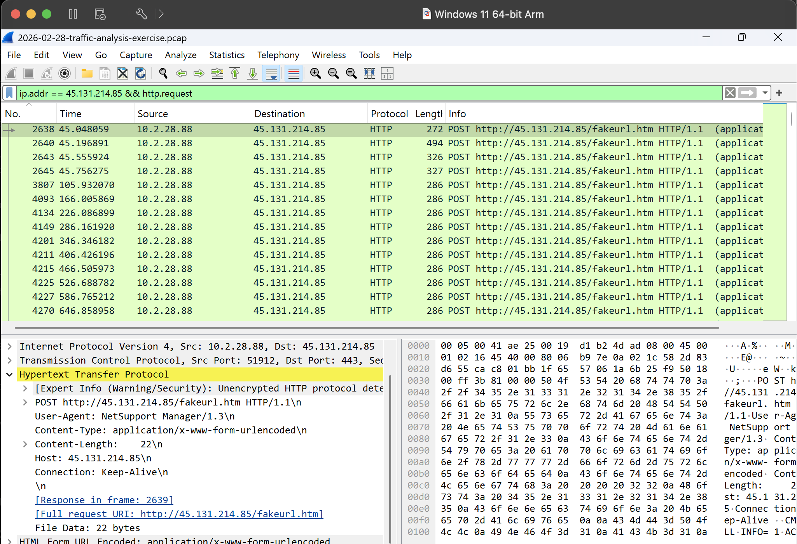
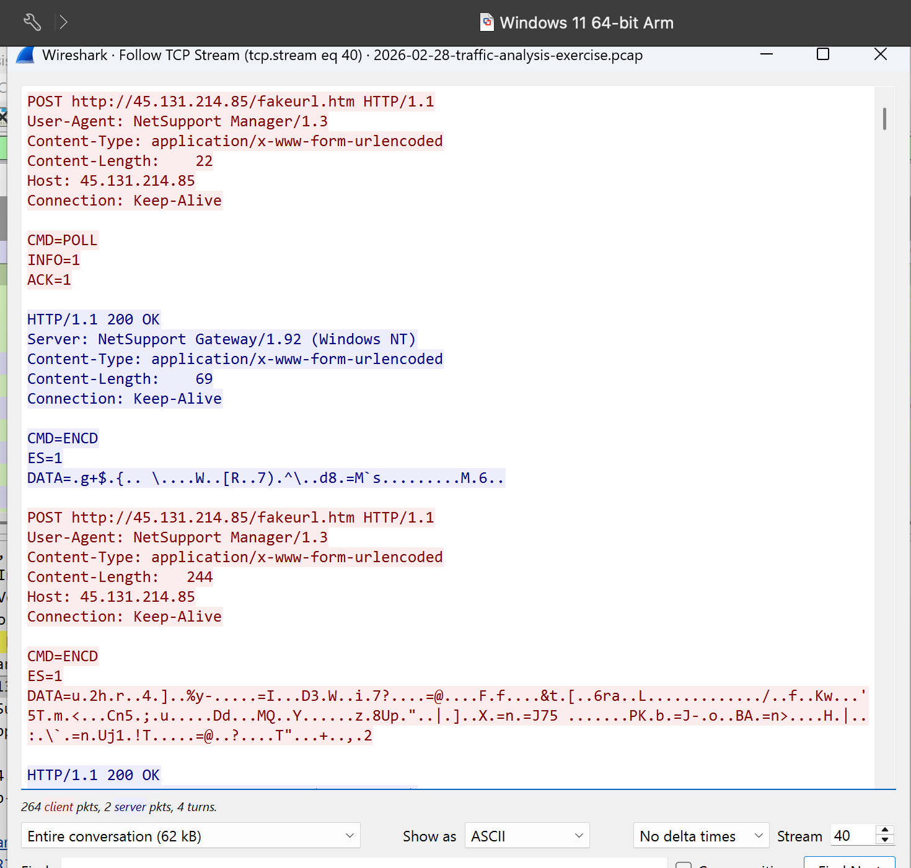
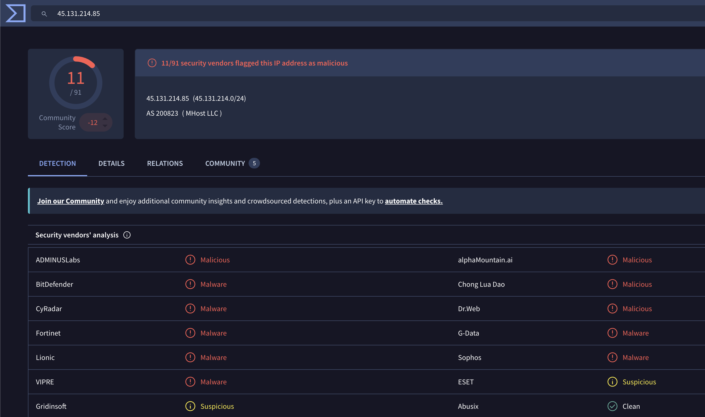
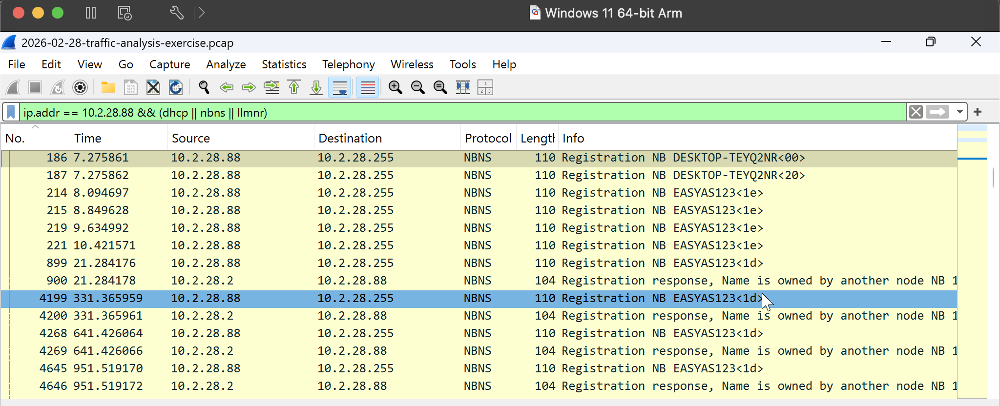
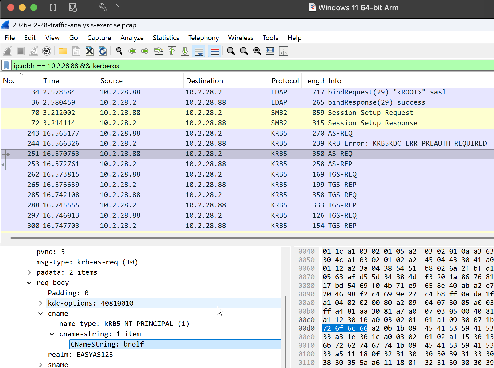
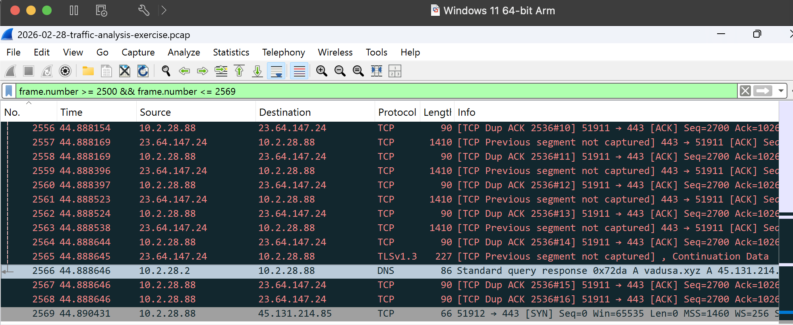
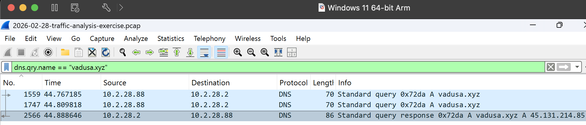
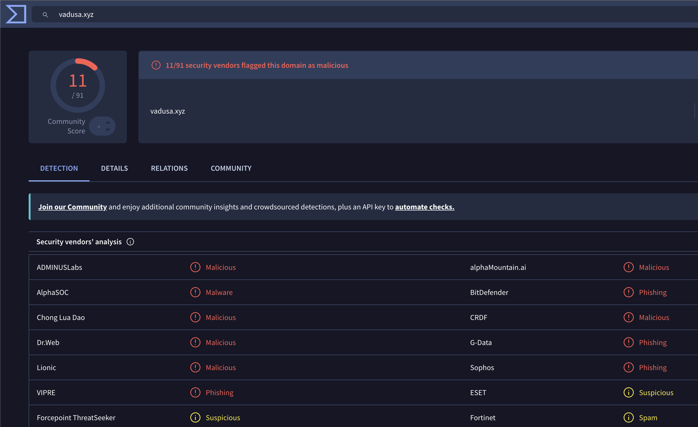
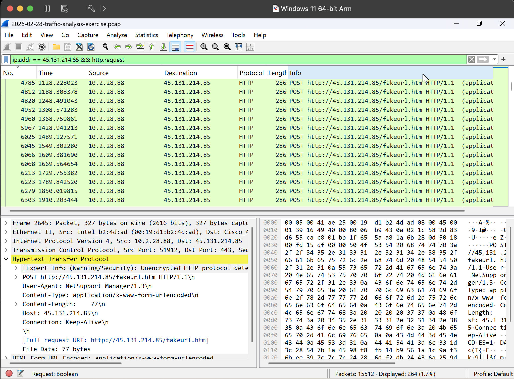

# Project 04 – Network Attack Investigation

## Overview

This project demonstrates a SOC-style network security investigation using packet capture (PCAP) analysis.

A suspicious Windows endpoint was investigated using Wireshark to identify the affected host and user, analyze external network communication, correlate DNS activity with remote infrastructure, inspect application-layer traffic, extract indicators of compromise (IOCs), and map observed behavior to MITRE ATT&CK.

The investigation identified sustained NetSupport Manager communication between an internal Windows endpoint and suspicious external infrastructure.

---

## Investigation Objectives

- Identify the affected endpoint
- Identify the associated user account
- Analyze suspicious external connections
- Inspect HTTP and TCP traffic
- Correlate DNS activity with remote infrastructure
- Identify command-and-control indicators
- Extract and enrich IOCs
- Map observed behavior to MITRE ATT&CK
- Produce an analyst verdict and response recommendations

---

## Tools Used

- Wireshark
- VirusTotal
- PCAP Analysis
- MITRE ATT&CK

---

## Evidence Source

The investigation was performed using the **Easy As 123** network traffic analysis exercise from Malware-Traffic-Analysis.net.

The original PCAP is not redistributed in this repository.

---

# Investigation

## 1. Initial PCAP Analysis

The packet capture contained **15,512 packets**.

Initial endpoint analysis identified the internal system:

```text
10.2.28.88
```



---

## 2. Suspicious HTTP Communication

Analysis of traffic involving `10.2.28.88` identified communication with:

```text
45.131.214.85
```

HTTP inspection revealed:

```text
POST /fakeurl.htm HTTP/1.1
User-Agent: NetSupport Manager/1.3
Host: 45.131.214.85
```

This identified NetSupport Manager-related network activity.



---

## 3. TCP Stream Analysis

Following the TCP stream exposed the application-layer conversation.

The client sent:

```text
CMD=POLL
INFO=1
ACK=1
```

The remote system responded with:

```text
HTTP/1.1 200 OK
Server: NetSupport Gateway/1.92 (Windows NT)

CMD=ENCD
ES=1
DATA=...
```

The stream demonstrated an active NetSupport client-to-gateway session with polling and encoded data exchange.



---

## 4. IP Reputation Enrichment

The external IP:

```text
45.131.214.85
```

was investigated using VirusTotal.

At the time of investigation, **7 security vendors** flagged the IP.

Threat-intelligence results were used as enrichment and correlated with the packet evidence rather than being treated as the sole basis for the incident verdict.



---

## 5. Compromised Endpoint Identification

NBNS traffic associated with `10.2.28.88` revealed the Windows hostname:

```text
DESKTOP-TEYQ2NR
```

This allowed the suspicious network traffic to be associated with a specific endpoint.



---

## 6. User Identification

Kerberos authentication traffic associated with the endpoint was analyzed.

The observed authentication information included:

```text
Username: brolf
Realm: EASYAS123
```

The network investigation could therefore associate the activity with both an endpoint and user context.



---

## 7. DNS and Network Correlation

Traffic immediately preceding the suspicious connection showed DNS resolution for:

```text
vadusa.xyz
```

The DNS response resolved the domain to:

```text
45.131.214.85
```

Immediately afterward, the endpoint initiated a TCP connection:

```text
10.2.28.88 → 45.131.214.85:443
```

The subsequent application traffic contained NetSupport Manager HTTP communication.



---

## 8. DNS Resolution Analysis

Filtering specifically for `vadusa.xyz` confirmed the DNS query and response relationship:

```text
10.2.28.88
      ↓
DNS query: vadusa.xyz
      ↓
45.131.214.85
```



---

## 9. Domain Reputation Enrichment

The identified domain:

```text
vadusa.xyz
```

was investigated using VirusTotal.

At the time of investigation, **7 security vendors** flagged the domain.



---

## 10. Sustained NetSupport Communication

Filtering HTTP requests involving `45.131.214.85` identified **264 requests**.

Repeated POST requests were observed to:

```text
/fakeurl.htm
```

The repeated polling and HTTP communication demonstrated sustained communication rather than an isolated connection.



---

# Affected Asset

| Attribute | Value |
|---|---|
| Hostname | `DESKTOP-TEYQ2NR` |
| Internal IP | `10.2.28.88` |
| User | `brolf` |
| Realm | `EASYAS123` |

---

# Indicators of Compromise

| Type | Indicator | Context |
|---|---|---|
| IP Address | `45.131.214.85` | Remote NetSupport infrastructure |
| Domain | `vadusa.xyz` | Resolved to remote infrastructure |
| URI | `/fakeurl.htm` | Repeated HTTP POST endpoint |
| User-Agent | `NetSupport Manager/1.3` | Remote-access client traffic |
| Server | `NetSupport Gateway/1.92` | Remote NetSupport gateway |

---

# Attack Sequence

```text
DESKTOP-TEYQ2NR
10.2.28.88
User: brolf
        │
        ▼
DNS Query
vadusa.xyz
        │
        ▼
45.131.214.85
        │
        ▼
TCP Connection
Destination Port 443
        │
        ▼
HTTP POST /fakeurl.htm
        │
        ▼
NetSupport Manager/1.3
        │
        ▼
CMD=POLL
        │
        ▼
NetSupport Gateway/1.92
        │
        ▼
Encoded Data Exchange
```

---

# MITRE ATT&CK Mapping

| Technique | ID | Evidence |
|---|---|---|
| Remote Access Software | T1219 | NetSupport Manager communication |
| Application Layer Protocol: Web Protocols | T1071.001 | HTTP POST communication |

---

# Analyst Verdict

Network analysis identified sustained NetSupport Manager communication between the Windows endpoint `10.2.28.88` (`DESKTOP-TEYQ2NR`, user `brolf`) and external infrastructure at `45.131.214.85`.

DNS telemetry showed `vadusa.xyz` resolving to the same IP immediately before the connection. The endpoint subsequently generated repeated HTTP POST requests to `/fakeurl.htm`, including polling behavior and encoded data exchange.

Threat-intelligence enrichment further identified both the IP address and domain as suspicious.

The combined evidence indicates likely unauthorized NetSupport remote-access activity and warrants treating the endpoint as compromised.

The available network evidence did not establish the original infection vector.

---

# Recommended Response Actions

1. Isolate `DESKTOP-TEYQ2NR` from the network.
2. Block `45.131.214.85` at appropriate network controls.
3. Block or monitor `vadusa.xyz`.
4. Search enterprise telemetry for both indicators.
5. Identify unauthorized NetSupport processes and services.
6. Preserve and collect endpoint forensic evidence.
7. Investigate persistence mechanisms.
8. Review activity associated with user `brolf`.
9. Determine the original infection vector.
10. Reset potentially exposed credentials where justified by further investigation.

---

# Skills Demonstrated

- Wireshark
- Network Traffic Analysis
- PCAP Analysis
- TCP/IP Analysis
- DNS Analysis
- HTTP Analysis
- TCP Stream Analysis
- Command-and-Control Analysis
- IOC Analysis
- Threat Intelligence
- MITRE ATT&CK Mapping
- Incident Investigation

---

## Outcome

The investigation successfully identified the affected Windows endpoint and user, correlated DNS activity with suspicious external infrastructure, identified sustained NetSupport remote-access communication, extracted actionable network indicators, and produced an evidence-based incident assessment.

**Status: Completed**