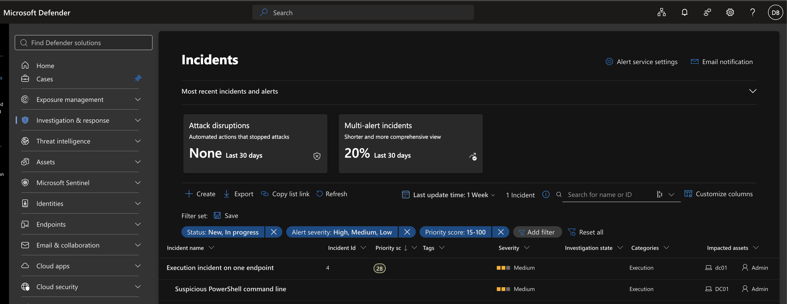
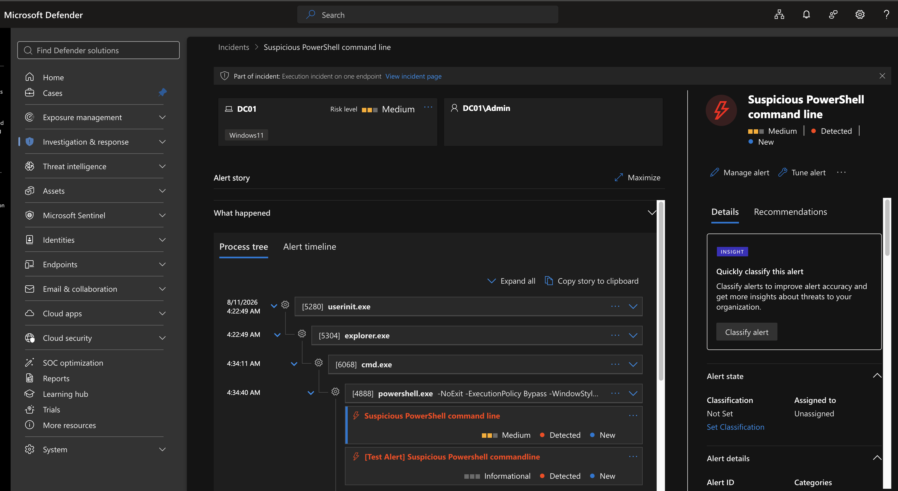
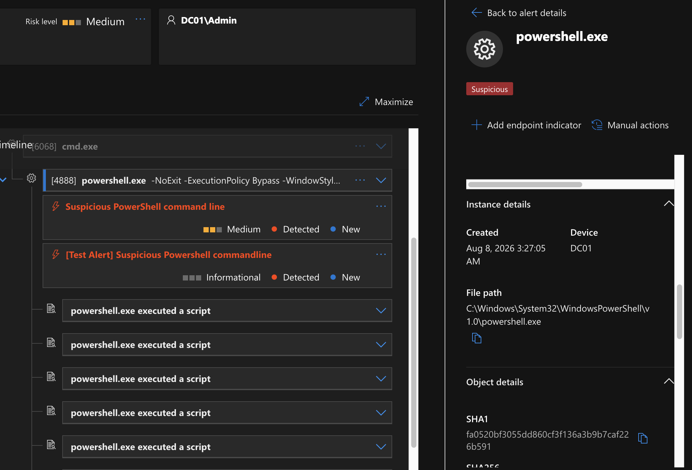
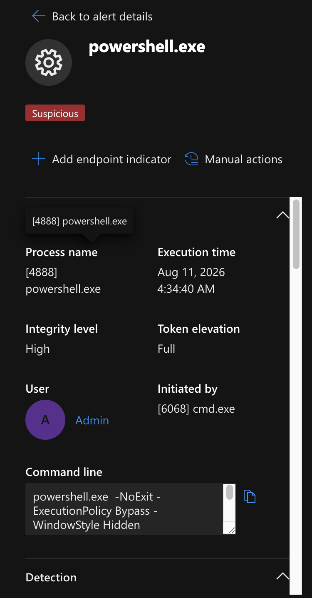
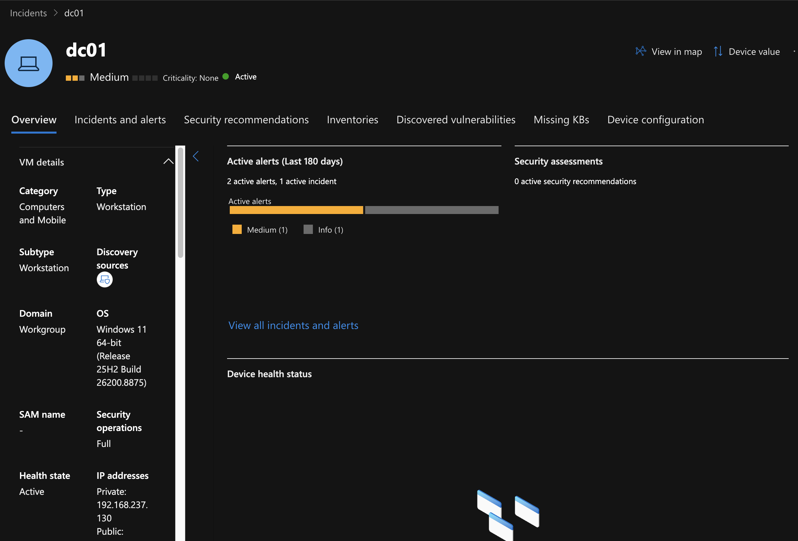
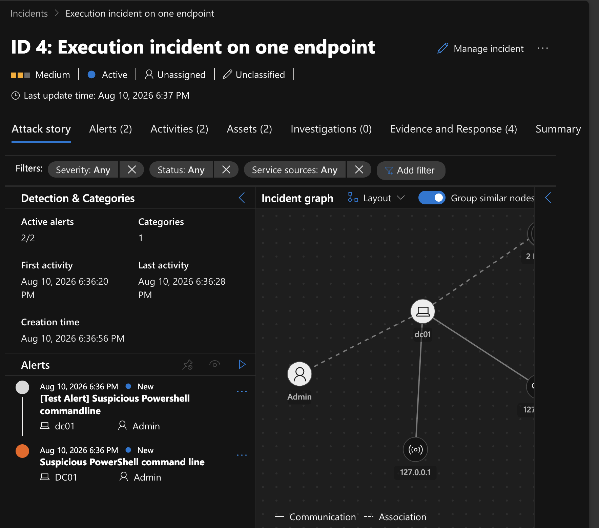
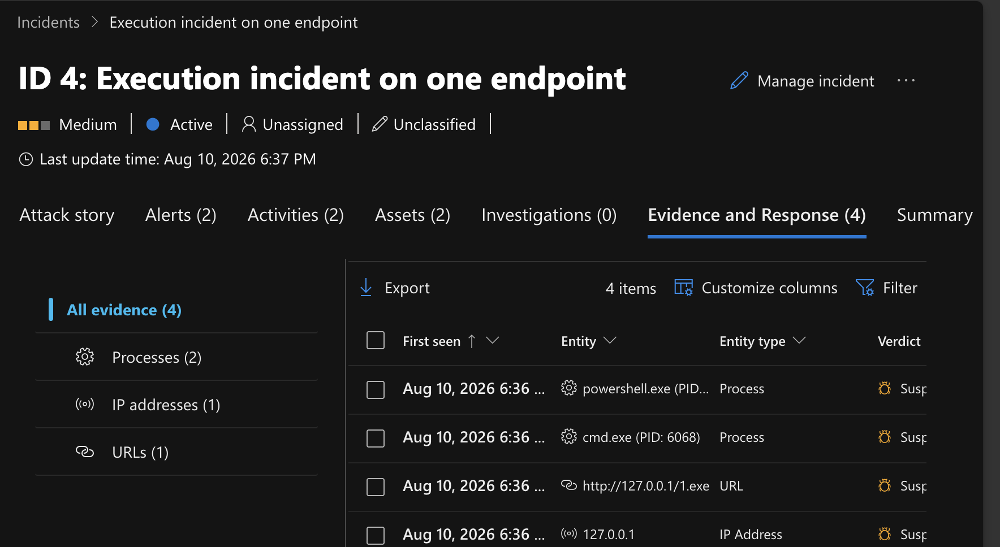
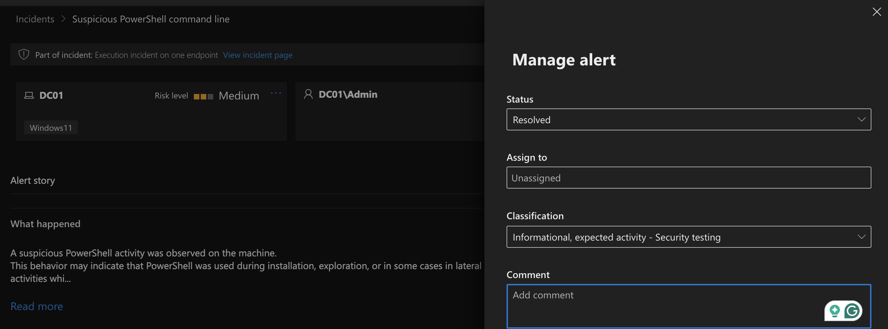
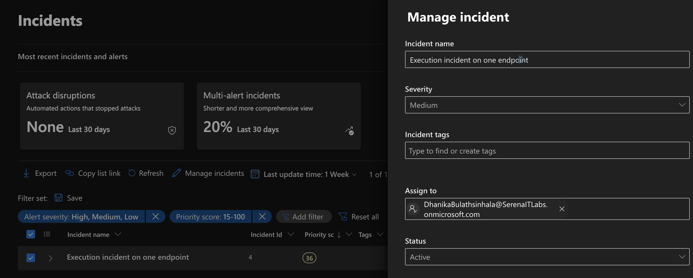
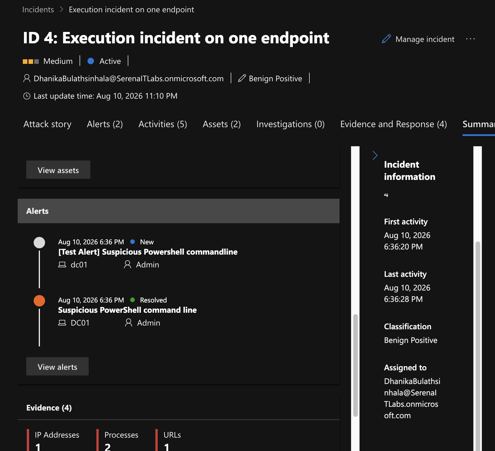

# Project 06 – Microsoft Defender XDR Incident Investigation

## Overview

This project demonstrates an endpoint security incident investigation using Microsoft Defender XDR and Microsoft Defender for Endpoint.

A controlled security test generated suspicious PowerShell activity on a Windows 11 endpoint. Microsoft Defender detected the activity, created alerts, and correlated them into an XDR incident.

The investigation followed the incident from initial detection through process analysis, evidence review, classification, and resolution.

## Environment

- Microsoft Defender XDR
- Microsoft Defender for Endpoint
- Windows 11
- Endpoint: `DC01`
- Incident ID: `4`
- Severity: Medium

## Investigation

### 1. Initial Detection

Microsoft Defender XDR generated an incident titled:

`Execution incident on one endpoint`

The incident contained a Medium-severity alert:

`Suspicious PowerShell command line`



### 2. Process Tree Analysis

Defender reconstructed the process execution chain:

```text
userinit.exe
    ↓
explorer.exe
    ↓
cmd.exe
    ↓
powershell.exe
```



### 3. PowerShell Process Investigation

The suspicious process was:

```text
C:\Windows\System32\WindowsPowerShell\v1.0\powershell.exe
```

The executable itself was legitimate Windows PowerShell. The suspicious behavior resulted from how PowerShell was invoked.



### 4. Command-Line Analysis

The detected command included:

```text
-NoExit
-ExecutionPolicy Bypass
-WindowStyle Hidden
```

It then used `System.Net.WebClient.DownloadFile()` and attempted to execute the resulting file using `Start-Process`.



### 5. Endpoint Investigation

The affected Windows 11 endpoint was reviewed in Defender XDR. The device was active and had been assigned a Medium risk level following the detection.



### 6. XDR Incident Correlation

Defender XDR correlated the activity into Incident ID 4 and associated the endpoint, user, alerts, process activity, and network-related evidence.



### 7. Evidence Review

The Evidence and Response view was reviewed for associated:

- Process evidence
- IP evidence
- URL evidence



## Classification

The activity was intentionally generated as an authorized Microsoft Defender for Endpoint security test.

The alert was therefore classified as:

```text
Informational, expected activity
Security testing
```

It was not classified as a false positive because Defender correctly identified genuinely suspicious PowerShell behavior.



The incident was subsequently documented and resolved.





## Analyst Verdict

**Authorized Security Testing – No Unauthorized Compromise Identified**

Microsoft Defender XDR successfully detected suspicious PowerShell execution and correlated the endpoint, identity, process, and related evidence into an investigation-ready incident.

## Skills Demonstrated

- Microsoft Defender XDR
- Microsoft Defender for Endpoint
- Endpoint Detection and Response (EDR)
- Alert triage
- XDR incident investigation
- Process tree analysis
- PowerShell investigation
- Command-line analysis
- Evidence analysis
- Incident classification
- Incident resolution