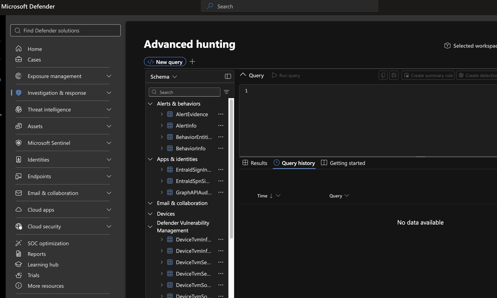
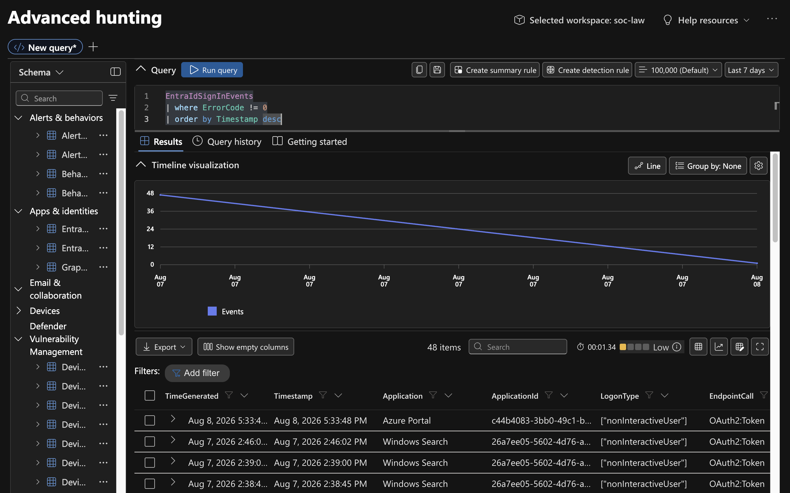
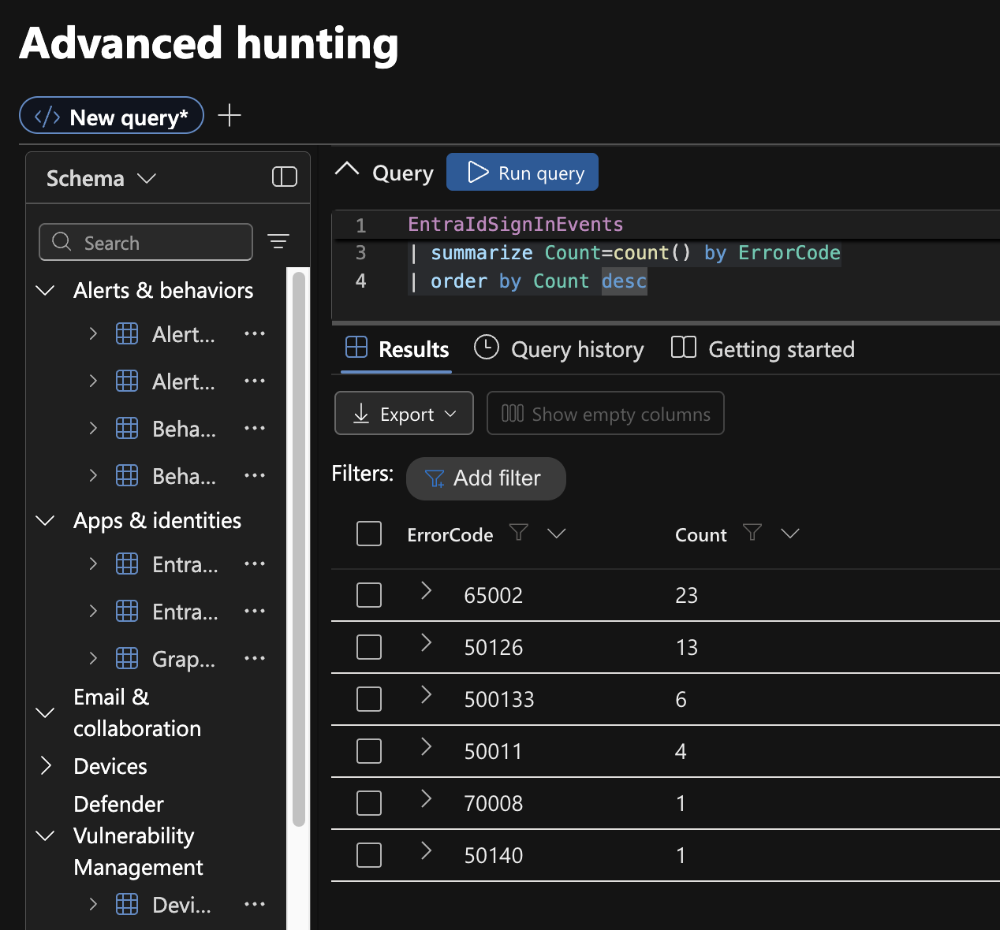
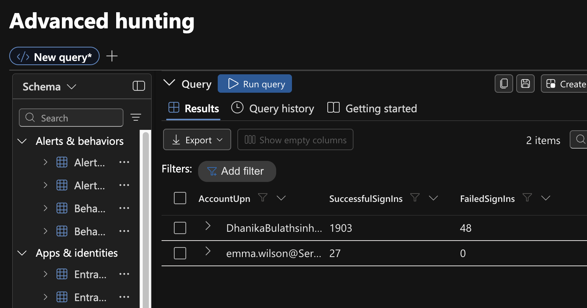
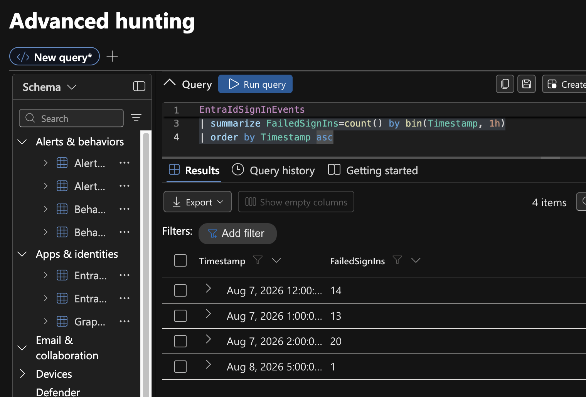
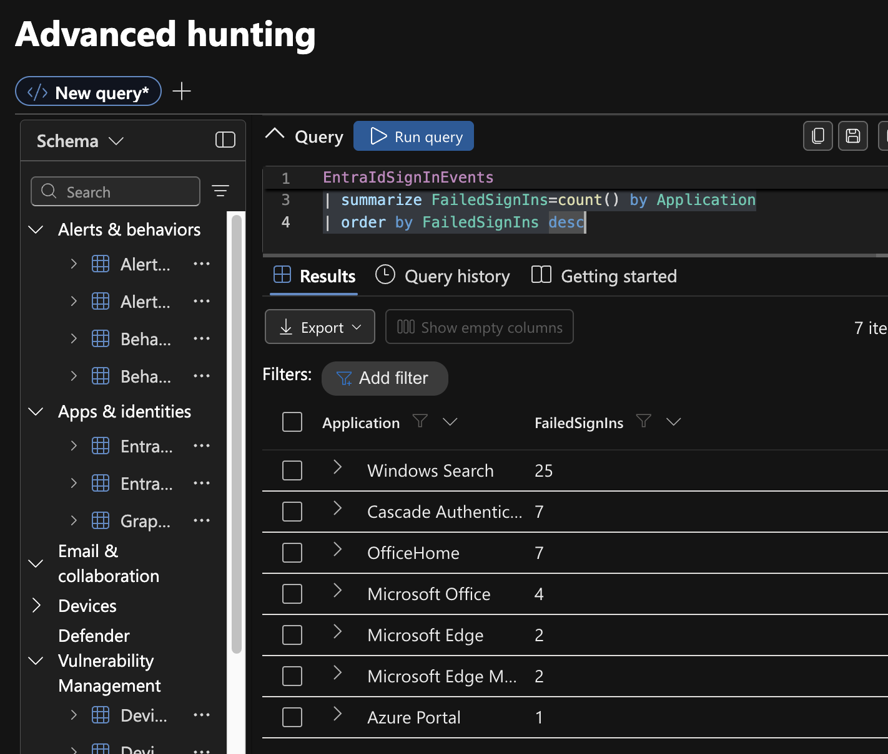

# Project 07 – Identity Threat Hunting with Microsoft Defender XDR

## Overview

This project demonstrates proactive identity threat hunting using Microsoft Defender XDR Advanced Hunting and Kusto Query Language (KQL).

The investigation focused on identifying and analyzing failed Microsoft Entra ID authentication activity. Rather than starting from a security alert, authentication telemetry was queried directly to identify potentially suspicious patterns.

The hunt identified 48 failed sign-in events associated with a single account and source IP. The activity was subsequently analyzed by account, authentication error code, time distribution, application, and successful sign-in volume.

## Environment

- Microsoft Defender XDR
- Advanced Hunting
- Microsoft Entra ID
- Kusto Query Language (KQL)
- `EntraIdSignInEvents`

## Hunting Objective

The primary hunting hypothesis was:

> Can repeated authentication failures reveal password guessing, password spraying, account compromise, or abnormal authentication behavior?

## Investigation

### 1. Advanced Hunting Environment

Microsoft Defender XDR Advanced Hunting was used to query identity authentication telemetry.



### 2. Failed Sign-In Discovery

The initial hunt identified:

```text
48 failed sign-in events
1 affected account
1 source IP
```



The concentration on one account and one source IP did not support a password-spraying pattern across multiple identities.

### 3. Authentication Error Analysis

Multiple authentication error codes were observed rather than a single repeated failure condition.



This indicated that the authentication failures required additional contextual analysis rather than being treated automatically as malicious password attempts.

### 4. Successful vs Failed Authentication

The affected account had:

```text
Successful sign-ins: 1,903
Failed sign-ins:        48
```

A second observed account had 27 successful sign-ins.



The high volume of successful authentication provided important context for evaluating the failed sign-ins.

### 5. Temporal Analysis

The failures were highly concentrated:

```text
Aug 7 – 12:00 hour     14
Aug 7 – 01:00 hour     13
Aug 7 – 02:00 hour     20
Aug 8 – 05:00 hour      1
                         --
Total                   48
```

Therefore, 47 of the 48 observed failures occurred within three hourly buckets on August 7.



The clustered activity warranted further investigation.

### 6. Application Analysis

The failures were associated primarily with Microsoft applications:

```text
Windows Search              25
Cascade Authentication       7
OfficeHome                   7
Microsoft Office             4
Microsoft Edge-related       4
Azure Portal                 1
                            --
Total                       48
```



Windows Search accounted for more than half of the observed failures.

## Analyst Assessment

The hunt identified a concentrated authentication anomaly but did not establish evidence of password spraying or account compromise.

Important observations included:

- Only one account was affected by the failed events.
- All observed failures originated from one source IP.
- Multiple authentication error codes were present.
- 47 of 48 failures were concentrated within three hourly periods.
- Most failures involved normal Microsoft applications.
- The affected account also recorded 1,903 successful sign-ins in the examined dataset.
- No multi-account password-spraying pattern was identified.

The available evidence is more consistent with an authentication, session, or application-related issue than a password-spraying attack. However, the observed telemetry alone does not establish the precise underlying cause.

## Verdict

**Suspicious authentication pattern investigated – insufficient evidence of malicious account compromise.**

## Skills Demonstrated

- Microsoft Defender XDR
- Advanced Hunting
- Microsoft Entra ID security
- Kusto Query Language (KQL)
- Identity threat hunting
- Authentication analysis
- Failed sign-in investigation
- Temporal analysis
- Application correlation
- Threat-hunting hypothesis development
- SOC investigation and documentation