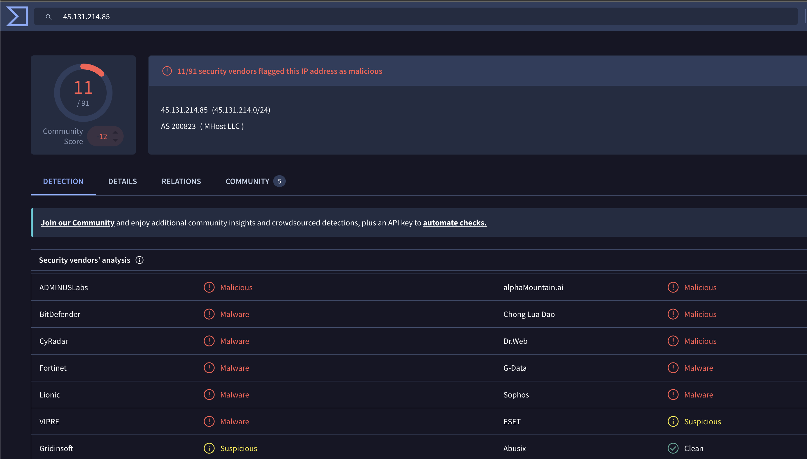
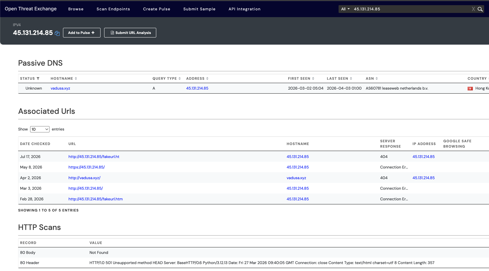
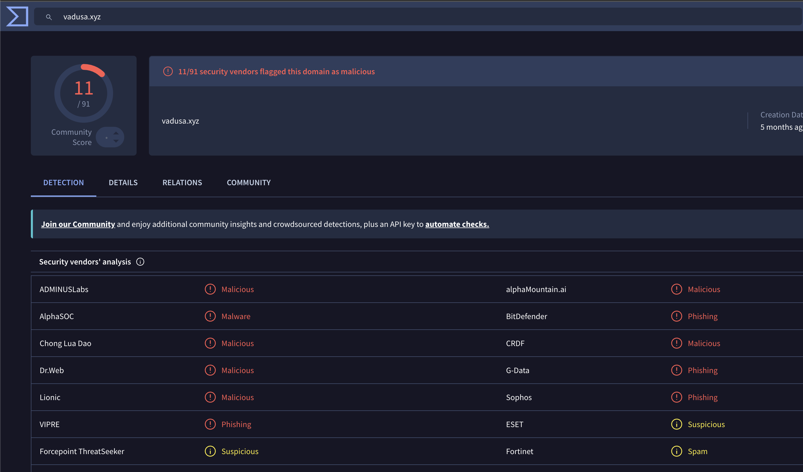

# Project 08 – Threat Intelligence & IOC Enrichment

## Overview

This project demonstrates threat intelligence analysis and Indicator of Compromise (IOC) enrichment using multiple open-source intelligence sources.

The investigation builds on suspicious infrastructure previously identified during network traffic analysis. The objective was to determine whether the observed IP address and domain were associated with malicious activity and to correlate the indicators using independent threat-intelligence sources.

## Tools Used

- VirusTotal
- AlienVault OTX
- AbuseIPDB
- Open-source threat intelligence
- IOC correlation and enrichment

## Indicators Investigated

| IOC | Type |
|---|---|
| `45.131.214.85` | IPv4 Address |
| `vadusa.xyz` | Domain |

## Investigation Workflow

```text
Suspicious IOC
      ↓
VirusTotal Reputation Analysis
      ↓
AbuseIPDB Check
      ↓
AlienVault OTX Enrichment
      ↓
Associated URL Analysis
      ↓
Domain ↔ IP Correlation
      ↓
Cross-source Validation
      ↓
Threat Intelligence Assessment
```

## 1. IP Reputation Analysis

The IP address `45.131.214.85` was investigated using VirusTotal.

Multiple security vendors classified the IP as malicious, malware-related, or suspicious.

Observed classifications included:

- ADMINUSLabs – Malicious
- alphaMountain.ai – Malicious
- BitDefender – Malware
- Chong Lua Dao – Malicious
- CyRadar – Malware
- Dr.Web – Malicious
- Fortinet – Malware
- G-Data – Malware
- Lionic – Malware
- Sophos – Malware
- VIPRE – Malware
- ESET – Suspicious
- Gridinsoft – Suspicious

This provided strong reputation evidence that the IP had been associated with malicious infrastructure.



## 2. AbuseIPDB Check

The IP address was also checked against AbuseIPDB.

No available record was identified during the investigation.

This illustrates an important threat-intelligence principle: absence of an IOC from one intelligence source does not establish that the indicator is benign.

IOC assessments should therefore use multiple independent sources.

## 3. OTX Infrastructure Enrichment

AlienVault OTX was used to investigate infrastructure associated with the suspicious IP.

OTX identified five associated URL observations, including:

```text
http://45.131.214.85/fakeurl.ht
https://45.131.214.85/
http://vadusa.xyz/
http://45.131.214.85/
http://45.131.214.85/fakeurl.htm
```

The most important correlation was:

```text
vadusa.xyz
     ↓
45.131.214.85
```

OTX recorded `vadusa.xyz` resolving to `45.131.214.85`.



This independently corroborated the relationship between the two indicators previously observed during network traffic analysis.

## 4. Domain Reputation Analysis

The associated domain `vadusa.xyz` was subsequently investigated using VirusTotal.

The domain reputation results were retained as supporting threat-intelligence evidence.



## IOC Correlation

The investigation produced the following infrastructure relationship:

```text
                  45.131.214.85
                       │
          ┌────────────┴────────────┐
          │                         │
VirusTotal reputation        AlienVault OTX
          │                         │
Multiple malicious/          Associated URLs
suspicious detections               │
                                    │
                               vadusa.xyz
                                    │
                                    └── resolved to
                                        45.131.214.85
```

## Analyst Assessment

The IP address `45.131.214.85` is assessed as a **high-confidence suspicious/malicious indicator** for the purposes of this investigation.

The assessment is supported by:

- Multiple independent VirusTotal security-vendor detections
- Malware-related vendor classifications
- OTX infrastructure intelligence
- Associated URL observations
- Correlation with `vadusa.xyz`
- Independent network evidence obtained during the earlier PCAP investigation

The absence of an AbuseIPDB record does not outweigh the positive evidence from the other intelligence sources.

The domain `vadusa.xyz` should be treated as associated suspicious infrastructure based on its observed relationship with the investigated IP and the retained VirusTotal domain-reputation evidence.

## Recommended SOC Actions

If these indicators were identified in an enterprise environment, recommended actions would include:

1. Search SIEM, DNS, proxy, firewall, and endpoint telemetry for the indicators.
2. Identify endpoints communicating with `45.131.214.85`.
3. Search historical DNS telemetry for `vadusa.xyz`.
4. Investigate processes responsible for related outbound connections.
5. Review associated URLs and network sessions.
6. Block confirmed malicious indicators where organizational policy and evidence support containment.
7. Monitor for related infrastructure and newly identified IOCs.
8. Preserve relevant network and endpoint evidence for further investigation.

## Screenshots

```text
01-VirusTotal-IP-Reputation.png
02-OTX-Associated-IOC-Infrastructure.png
03-VirusTotal-Domain-Reputation.png
```

## Skills Demonstrated

- Threat intelligence analysis
- IOC enrichment
- VirusTotal investigation
- AlienVault OTX investigation
- IP reputation analysis
- Domain reputation analysis
- Passive infrastructure correlation
- Cross-source intelligence validation
- IOC confidence assessment
- SOC documentation