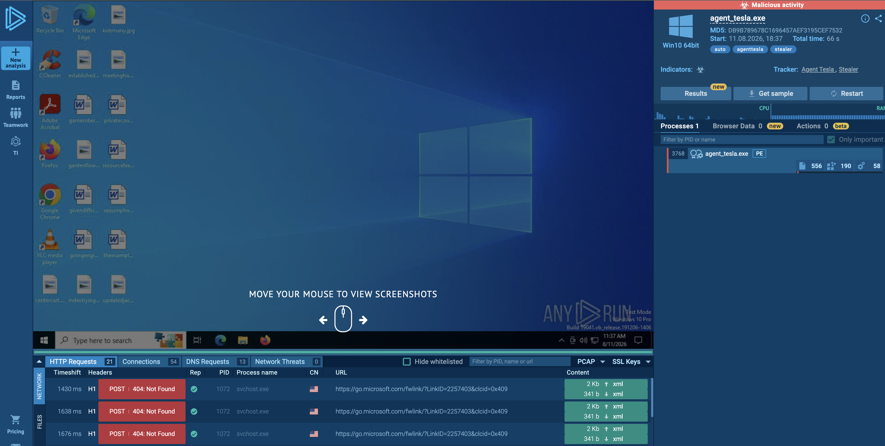
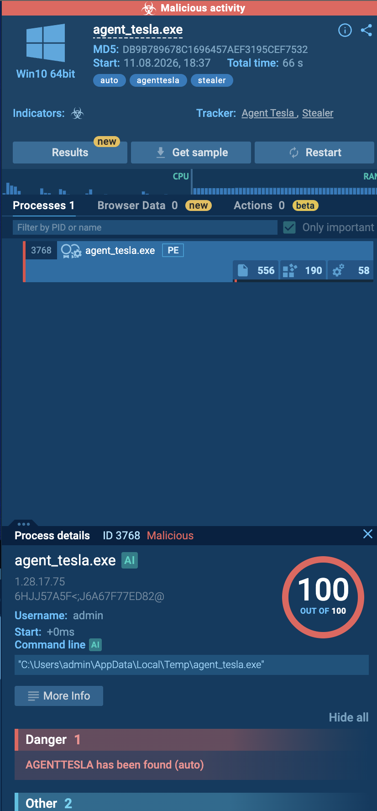
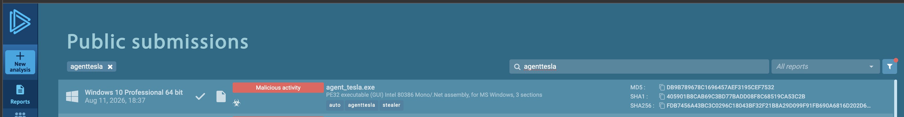
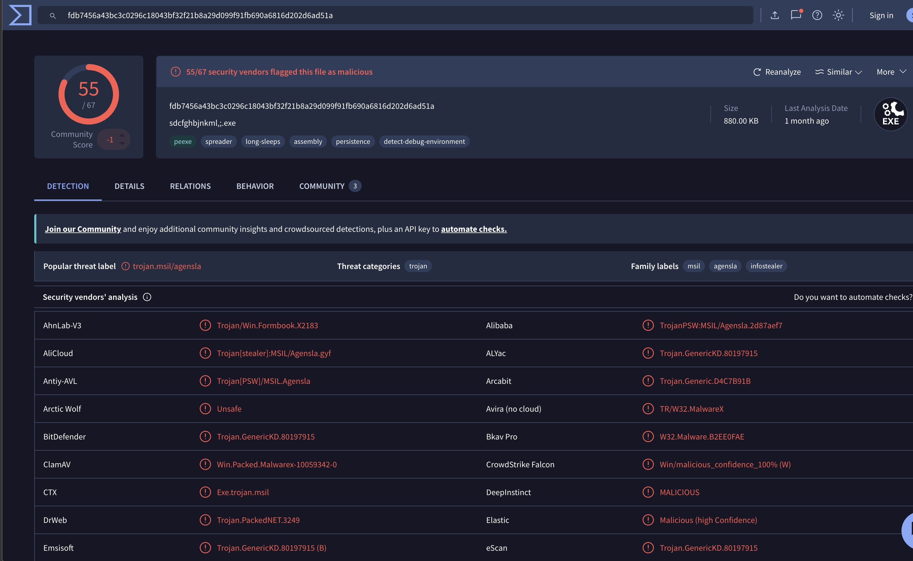

# Project 09 – Malware Analysis & Incident Response

## Overview

This project demonstrates malware triage, behavioral analysis, IOC extraction, threat-intelligence enrichment, and incident-response planning using an Agent Tesla malware sample analyzed in a public sandbox.

The malware was **not executed locally**. Analysis was performed using an existing ANY.RUN sandbox submission and VirusTotal intelligence.

The investigation followed a SOC workflow:

```text
Malware Detection
      ↓
Sandbox Triage
      ↓
Process Investigation
      ↓
File & Hash Analysis
      ↓
Threat Intelligence Enrichment
      ↓
Incident Assessment
      ↓
Containment & Remediation Plan
```

## Tools Used

- ANY.RUN
- VirusTotal
- MITRE ATT&CK
- IOC analysis
- Incident-response methodology

## Sample Information

```text
Malware Family: Agent Tesla
Type: Information Stealer
File: agent_tesla.exe
User: admin
PID: 3768

Execution Path:
C:\Users\admin\AppData\Local\Temp\agent_tesla.exe

SHA256:
fdb7456a43bc3c0296c18043bf32f21b8a29d099f91fb690a6816d202d6ad51a
```

## 1. Sandbox Triage

The sample was analyzed using an existing ANY.RUN sandbox submission.

The sandbox identified:

```text
Verdict: Malicious
ANY.RUN Score: 100/100
Detection: AGENTTESLA has been found
Tags: agenttesla, stealer
Environment: Windows 10 64-bit
```



## 2. Process Investigation

The malicious process was identified as:

```text
Process: agent_tesla.exe
PID: 3768
User: admin

Path:
C:\Users\admin\AppData\Local\Temp\agent_tesla.exe
```

Execution from the user's temporary directory was treated as relevant investigation context.



## 3. File Identification

The SHA-256 hash extracted from the sandbox evidence was:

```text
fdb7456a43bc3c0296c18043bf32f21b8a29d099f91fb690a6816d202d6ad51a
```



## 4. Threat Intelligence Enrichment

The SHA-256 indicator was investigated independently using VirusTotal.

The VirusTotal result was used to validate the malicious reputation of the sample and compare the sandbox classification with external security-vendor intelligence.



## Network Analysis

No network connection was confidently attributable to PID `3768` in the sandbox telemetry reviewed during this investigation.

Therefore, no C2 infrastructure or network IOC was claimed as confirmed evidence.

This distinction prevents unrelated sandbox traffic from being incorrectly attributed to the malware.

## Incident Assessment

```text
Classification: True Positive – Malware
Severity: High
Malware: Agent Tesla
Affected User: admin
Containment Required: Yes
```

## MITRE ATT&CK Assessment

ATT&CK techniques were not assigned solely because they are commonly associated with the Agent Tesla malware family.

Only techniques directly supported by the observed incident evidence should be treated as confirmed.

This avoids confusing known malware-family capabilities with behavior actually observed during a specific investigation.

## Recommended Response

If this activity were identified on an enterprise endpoint:

1. Isolate the affected endpoint.
2. Terminate and quarantine the malicious executable.
3. Block the confirmed SHA-256 IOC.
4. Search EDR/SIEM telemetry for the same hash across the environment.
5. Investigate parent and child processes.
6. Determine the malware delivery mechanism.
7. Search email, proxy, browser, and download telemetry.
8. Investigate persistence mechanisms.
9. Assess potential credential exposure based on additional evidence.
10. Reset credentials if compromise is established.
11. Perform a complete endpoint security scan.
12. Remove malicious artifacts and persistence.
13. Restore the endpoint to a trusted state.
14. Monitor the endpoint and identity for recurrence.

## Analyst Verdict

**True Positive – Malware**

The available sandbox and threat-intelligence evidence confirms that the investigated executable should be treated as malicious.

No assumptions were made about network C2 activity or additional malware behavior that could not be confirmed from the evidence reviewed.

## Screenshots

```text
01-AgentTesla-Sandbox-Overview.png
02-AgentTesla-Process-Behavior.png
03-AgentTesla-File-Hash.png
04-AgentTesla-VirusTotal-Detection.png
```

## Skills Demonstrated

- Malware triage
- Sandbox analysis
- Process investigation
- File-hash analysis
- IOC extraction
- VirusTotal enrichment
- Evidence validation
- Incident classification
- MITRE ATT&CK assessment
- Containment planning
- Eradication planning
- Recovery planning
- SOC incident documentation