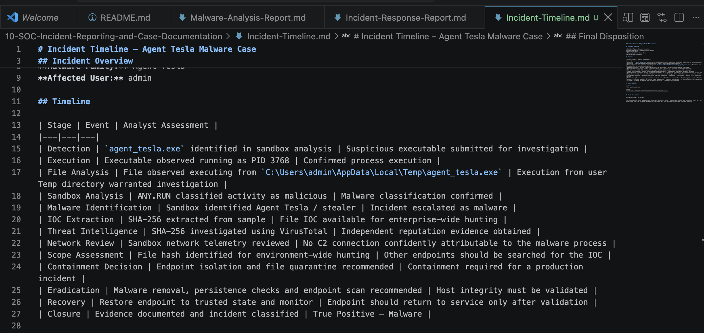
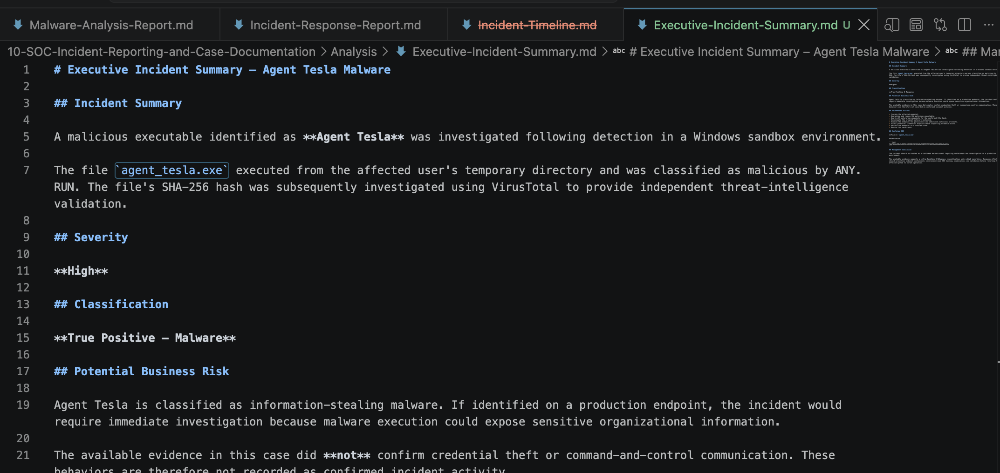
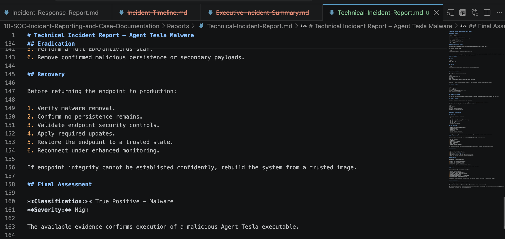

# Project 10 – SOC Incident Reporting & Case Documentation

## Overview

This project demonstrates the documentation and communication phase of a SOC investigation.

Technical evidence from an Agent Tesla malware case was transformed into structured documentation for both security teams and management.

The project focuses on converting investigation findings into clear, evidence-based, actionable incident reporting.

## Case

```text
Incident: Agent Tesla Malware Execution
Classification: True Positive – Malware
Severity: High
Affected User: admin
```

### Confirmed IOC

```text
File: agent_tesla.exe

SHA256:
fdb7456a43bc3c0296c18043bf32f21b8a29d099f91fb690a6816d202d6ad51a
```

## Reporting Workflow

```text
Technical Evidence
        ↓
Incident Timeline
        ↓
Evidence Validation
        ↓
Severity & Classification
        ↓
Technical Incident Report
        ↓
Executive Summary
        ↓
Remediation Recommendations
```

## 1. Incident Timeline

A structured timeline documents the progression from initial malware detection through investigation, IOC extraction, threat-intelligence enrichment, containment planning, eradication, recovery, and closure.



## 2. Executive Incident Summary

A concise management-level report communicates:

- What happened
- Incident severity
- Potential business risk
- Confirmed evidence
- Recommended response
- Final classification



The executive report intentionally avoids unnecessary technical detail while preserving the information required for response decisions.

## 3. Technical Incident Report

The technical report provides detailed evidence for SOC analysts and incident responders, including:

- Process information
- File path
- SHA-256 IOC
- Sandbox findings
- Threat-intelligence enrichment
- Scope assessment
- Containment actions
- Eradication actions
- Recovery recommendations



## Evidence-Based Reporting

The investigation distinguishes between **confirmed evidence** and **unconfirmed malware capabilities**.

### Confirmed

```text
Agent Tesla detection
Malicious executable execution
PID 3768
User: admin
Execution from user Temp directory
SHA256 IOC
ANY.RUN malicious verdict
VirusTotal enrichment
```

### Not Confirmed

```text
Command-and-control communication
Credential theft
Data exfiltration
Persistence
Initial delivery mechanism
```

This prevents known malware-family capabilities from being incorrectly presented as behaviors observed in the investigated incident.

## Reports

```text
Reports/
├── Executive-Incident-Summary.md
├── Technical-Incident-Report.md
└── Incident-Timeline.md
```

## Skills Demonstrated

- SOC incident documentation
- Technical security reporting
- Executive security communication
- Incident timeline development
- Evidence validation
- Incident classification
- Severity assessment
- IOC documentation
- Containment recommendations
- Eradication planning
- Recovery planning
- Communication of technical risk

## Final Outcome

The project demonstrates the final stage of the SOC incident lifecycle:

```text
Detect
  ↓
Investigate
  ↓
Validate
  ↓
Respond
  ↓
Document
  ↓
Communicate
```

The same technical evidence was presented at different levels of detail for SOC analysts, incident responders, and management.